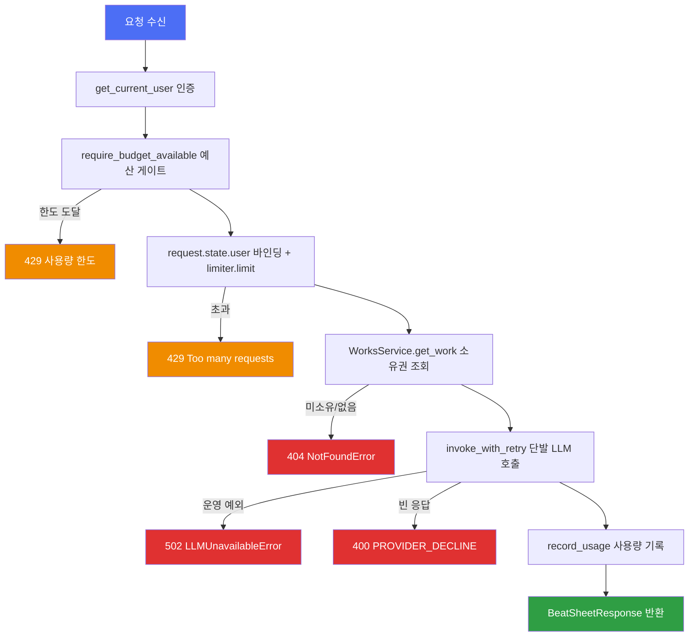

# ARCHITECTURE

## 1. 전체 패턴

모노레포 = `api/`(FastAPI, Python ≥3.12) + `web/`(React 19 SPA). 루트 `Taskfile.yml`이 `includes:`로 두 앱 Taskfile을 `api:`/`web:` 네임스페이스로 묶고, 계약 동기화 태스크(`task contract` = `api:openapi` + `web:generate`, 검증까지 포함한 `task contract-check`)로 둘을 잇는다.

- **api** — 라이트 모듈러 모놀리스(DDD 경량). `api/src/domains/<bc>/` 15개 디렉터리, 각각 최대 5계층(`router/service/repository/models/schemas`)으로 자기 완결. `src/`가 Python import 루트(`PYTHONPATH=src`). 실측 `api/src` 161 파일 13,974 LOC, `api/tests` 110 파일 20,653 LOC(리포 전체 `.py` 36,852 LOC).
- **web** — TanStack Router 파일 기반 라우팅 + 기능 단위(`web/src/features/<도메인>/`) 구조. 실측 `web/src` 비생성 `.ts/.tsx` 20,637 LOC, 생성물 `web/src/api/` 17 파일 7,651 LOC + `routeTree.gen.ts` 599 LOC.
- 두 앱의 유일한 접점은 OpenAPI 스펙 파일 `docs/openapi.json`(OpenAPI 3.1.0, 53 path / 71 operation)이다 — 코드 레벨 공유 없음(6절).

## 2. 백엔드 계층 구조와 책임

`works` 도메인(`api/src/domains/works/`)이 계층 책임의 기준 사례다:

- **router** (`router/works_router.py`, 202줄) — HTTP 경계. `Depends(get_current_user)` 인증, `Depends(_get_service)`로 서비스·리포지토리 조립, `AppError`를 `HTTPException`으로 변환(`_raise_http`), ORM 모델을 camelCase 프론트 계약 `WorkResponse`로 매핑(`_to_response`가 `lastEditedLabel`을 파생 계산). LLM 엔드포인트는 여기서 예산·레이트리밋 게이트를 조립한다(3절).
- **service** (`service/works_service.py`) — 비즈니스 로직. `user_id: uuid.UUID`만 받고 `domains.auth`의 `User` 모델을 경계 안으로 들이지 않는다(파일 상단 주석 명시). 소유권 위반은 `NotFoundError`(404)로만 표현해 교차 테넌트 존재 여부를 노출하지 않는다(ADR-0005).
- **repository** (`repository/works_repository.py`) — SQLAlchemy 쿼리. 모든 조회가 `user_id` 스코프(`get_owned`, `list_by_user`). `add`/`flush`만 하고 커밋하지 않는다.
- **models** (`models/works_models.py`) — `core.database.Base` 상속. `Work`가 소유 루트(`user_id` FK)이고 하위 도메인 테이블은 `work_id` FK를 격리 뿌리로 삼는다.
- **schemas** (`schemas/works_schemas.py`) — Pydantic 요청/응답, 필드명을 `web/src/features/shared/types.ts` 계약에 맞춘다.

**트랜잭션 경계** — 커밋은 `core/database.py`의 `get_async_session` 의존성이 요청 단위로 수행한다(성공 시 `commit`, 예외 시 `rollback`, 항상 close). 엔진은 `pool_size=5`/`max_overflow=10`/`pool_pre_ping=True`/`pool_recycle=3600`, 세션 팩토리는 `expire_on_commit=False`·`autoflush=False`. 리포지토리가 직접 커밋하는 예외는 `chat/repository/llm_call_log_repository.py`(2곳) 하나뿐 — LLM 호출 로그를 요청 트랜잭션과 분리해 남기기 위함.

**마이그레이션** — 도메인이 서로를 import하지 않는 대신 `api/alembic/env.py`가 8개 도메인(`auth`·`chat`·`works`·`manuscript`·`worldbible`·`timeline`·`memory`·`dynamic_update`)의 `models` 모듈을 `# noqa: F401`로 명시 import해 `Base.metadata`를 채운 뒤 autogenerate를 돌린다. 즉 스키마 전체를 아는 곳은 `env.py` 한 곳이다. 리비전 파일은 현재 2개(`0001_initial_schema.py` 24KB, `0002_purge_empty_embeddings.py`)로, 스키마 변경이 초기 1장에 압축되어 있다.

**도메인별 계층 구성**

| 구성 | 도메인 |
|---|---|
| 5계층 완비 | `auth` `chat` `works` `manuscript` `worldbible` `timeline` `memory` `dynamic_update` (8) |
| `router/schemas/service`만(자체 테이블 없음) | `conflicts` `relationships` |
| `service`만 | `budget` `moderation` `image_generation` |
| 계층 없음(모듈 3개) | `shared` (`base.py`·`events.py`·`types.py`) |

계층 밖 모듈을 추가로 가진 도메인: `chat`(`ports.py` 414줄·`container.py`·`llm_client.py` 544줄·`llm_factory.py` 266줄 — 가장 두꺼움, `router/chat_router.py` 863줄이 리포 최대 파일), `auth`(`oauth/{google,kakao,naver}.py`·`security.py` 415줄·`admin_ops.py`·`email.py`), `assist`(`tier_routing.py`·`correct_cache.py`), `memory`(`embedding_client.py`), `budget`(`dependency.py`), `conflicts`(`rules.py`).

**`image_generation`은 현재 완전 고아다** — `api/src` 안에서 이 도메인을 import하는 코드가 0건이고(grep 확인), `main.py`에 라우터도 등록되지 않으며 `web/`에도 참조가 없다. 유일한 사용자는 `api/tests/image_generation/test_image_generation_service.py`다. 코드는 있으나 배선되지 않은 상태로 봐야 한다.

**원고 테이블 구조** — `manuscript/models/manuscript_models.py` 기준 실제 테이블은 `works` → `synopses`(작품당 1) / `episodes` → `chapters`이고, `chapters`가 `body`·`global_seq`를 직접 보유한다. `scenes` 테이블은 없다(모델 주석: "scenes 테이블은 폐지 — 챕터가 집필·AI 생성의 최소 단위로 흡수", `.forge/adr/260716-17a-remove-scene-collapse-into-chapter.md`). 다만 timeline 링크 테이블명은 통합 이전 이름 `scene_entity_links`로 남아 있고 컬럼은 `chapter_id`이며 유니크 제약도 `uq_scene_entity_links_chapter_entity`다 — 테이블명과 현재 어휘가 어긋나는 지점이므로 쿼리·마이그레이션 작성 시 주의.

**URL 트리** — `api/src/main.py`의 `_register_routers()`가 등록하는 14개 라우터(전부 `try/except ImportError`로 감싼 점진 도입 패턴):

- 인증 없음 — `/health`, `/ready`(postgres·redis·mailpit 실네트워크 검사, 하나라도 실패 시 503)
- `/api/v1/auth`(12 op), `/api/v1/chat`(전역 채팅) + `/api/v1/works/{work_id}/chat`(작품 단위 채팅, 별도 `chat_router.work_router` — 합계 12 op)
- `/api/v1/works`(6 op) 및 그 하위: `.../synopsis`(manuscript 16 op) · `.../entities`(worldbible 5) · `.../entities/{entity_id}/timeline-states`와 `.../chapters/{chapter_id}/links`(timeline 5) · `.../chapters/{chapter_id}/memory`(1) · `.../chapters/{chapter_id}/assist`(6) · `.../chapters/{chapter_id}/extract-updates`(dynamic-update 4) · `.../conflicts`(1) · `.../relationships`(1)

즉 `works`가 사실상 모든 하위 도메인의 URL 네임스페이스 루트이며, 이는 모델 레벨의 "`work_id`가 격리 뿌리" 규칙이 라우팅에도 그대로 반영된 것이다.

## 3. 요청 처리 흐름 — LLM 게이트 체인

**중요한 변화: moderation 도메인은 더 이상 콘텐츠 수위를 판정하지 않는다.** ADR `260730-070532`으로 제품이 강제하던 연령·수위 제한이 전부 제거됐고, 과거의 선제 키워드 가드(`is_explicit_content`)는 코드에서 사라졌다(grep 0건). 도메인 이름만 리네임 비용 때문에 남았다. 현재 `moderation/service/moderation_service.py`(151줄)의 책임은 **LLM 호출 실패를 두 부류로 가르는 것**뿐이다:

- **운영 실패** — litellm 예외 8종(`AuthenticationError`·`PermissionDeniedError`·`RateLimitError`·`ServiceUnavailableError`·`InternalServerError`·`BadGatewayError`·`APIConnectionError`·`Timeout`) → `LLMUnavailableError`(502). provider raw 메시지 대신 `LLM_UNAVAILABLE_MESSAGE`만 노출.
- **제공자 거절** — 빈 응답이거나 그 외 알 수 없는 예외 → `PROVIDER_DECLINE_MESSAGE`. 제공사별 거절 신호가 제각각이라 "생성물이 없다"는 사실로만 판정한다.

`stream_with_retry`/`invoke_with_retry`는 **이름에 반해 재시도하지 않는다** — 호출부 6곳을 건드리지 않으려 이름만 유지했다고 docstring에 명시돼 있다. 이 때문에 코드 주석 여러 곳이 낡았다: `works_router.py`(139–141줄 "precheck→budget→rate→완화 재시도", 193줄 "S2 완화 재시도 … 1회 재시도")와 `chat_router.py`(700줄 "moderation 완화 재시도 … ADR-0003")는 지금 코드와 맞지 않는다.

대표 경로 `POST /api/v1/works/{work_id}/beat-sheet`(`works_router.generate_beat_sheet`)의 실제 순서: 인증 → 예산 게이트(`require_budget_available` — 누적 사용량 ≥ `budget_token_limit`이면 429) → 레이트리밋 사용자 바인딩(`_bind_rate_limit_user`가 `request.state.user` 채움) → `@limiter.limit(LLM_RATE_LIMIT)` → 소유권 조회 → `invoke_with_retry` 단발 호출 → 거절이면 400 → `record_usage` → 응답.



일반 CRUD(`list_works`/`get_work`/`update_work`/`delete_work`)는 이 게이트 없이 `인증 → 서비스 호출(소유권 스코프) → 응답 매핑`의 단순 선형 흐름이다.

## 4. 스트리밍 취소 회계 — 최신 교차 관심사

SSE 스트리밍 경로 3곳이 하나의 불변식을 공유한다: `assist_router._stream_response`, `chat_router._stream_work_chat_response`, `manuscript_router._stream_synopsis_continue`. 클라이언트가 스트림을 끊으면(프론트 `AbortController` → `http.disconnect` → sse-starlette의 anyio 태스크그룹 취소) 제너레이터에 `asyncio.CancelledError`가 도달하는데, **그 핸들러/`finally` 안의 첫 `await`은 감싸는 취소 스코프가 아직 취소 상태라 즉시 재취소된다.** 그래서 `anyio.CancelScope(shield=True)` 안에서만 완주한다. 차감하지 않으면 시작-취소 반복으로 하드 쿼터(`budget_token_limit`)를 무제한 우회할 수 있다(ADR `260801-014029`). 작품 채팅은 같은 shield 안에서 부분 응답을 `finish_reason='cancelled'`로 저장까지 한다(ADR `260801-072534`).

이 불변식은 단위 테스트로 잡히지 않는다(평범한 `task.cancel()`은 취소를 한 번만 전달해 shield를 지워도 green). 그래서 `api/tests/test_stream_cancel_shield.py`(162줄)가 실제 uvicorn(포트 8933) + 실제 `EventSourceResponse` + 실제 클라이언트 끊김으로 운영 코드를 그대로 태우고, `test_stream_cancel_accounting.py`(215줄)가 세 경로를 한 파일에 나란히 고정한다. `anyio>=4.6.0`은 이 목적으로 pyproject에 명시된 직접 의존성이다.

```
스트림 진행 → 청크 yield(sent 누적) → [DONE] → _charge_sent
      ↓ 클라이언트 abort
  CancelledError → anyio.CancelScope(shield=True) 안에서
      ├─ (assist/synopsis) _charge_sent = 받은 분량만 예산 차감
      └─ (work chat) add_message(finish_reason='cancelled') + commit + record_usage
      ↓
   raise (취소 전파)
```

## 5. 핵심 추상화

- **LLM 포트/어댑터** (`api/src/domains/chat/ports.py`) — `LLMClientProtocol`(`@runtime_checkable` 구조적 프로토콜, `ainvoke`/`astream`), `LLMClientFactoryProtocol`, `AbstractLLMPort`(명시적 ABC, `@abstractmethod invoke`/`stream`). 두 축을 함께 두는 이유가 파일에 문서화돼 있다 — Protocol은 ABC를 상속할 수 없는 서드파티 타입용, ABC는 1차 어댑터 강제용.
- **DI 경계** (`chat/container.py`) — 인프라(`llm_client`)와 도메인 인터페이스(`ports`)를 잇는 **단일 등록 지점**. `get_llm_factory()`가 `DefaultLLMClientFactory`를 **함수 안에서 lazy import**해 모듈 네임스페이스에 구체 클래스가 새지 않게 한다(`vars(container)` 검사로도 경계가 보이도록 한 의도적 선택). 테스트는 `app.dependency_overrides[get_llm_factory]`로 갈아끼운다.
- **프로바이더 팩토리** (`api/src/infra/llm/provider_factory.py`) — `ChatLiteLLM()`을 생성하는 **유일한 지점**. 라우팅 로직은 `core/config.py`의 `LLMSettings.as_litellm_kwargs()`에 있어 프로바이더 전환은 `LLM_PROVIDER` 환경변수만 바꾸면 된다(openai·anthropic·gemini·azure·ollama·openai_compatible).
- **품질 티어 라우팅** (`assist/tier_routing.py`) — `TaskType` 6종(`continue`/`infill`/`dialogue`/`style`/`correct`/`title`) → `Tier`(`low_cost`/`high_quality`)를 `TASK_TIER` 표로 매핑하고, `_TIER_FACTORY_GETTERS` dict가 티어→팩토리 getter를 분기한다(현재 두 항목 모두 `get_llm_factory` — 실 프로바이더가 하나뿐). **`get_fast_writing_client()`는 이 표를 의도적으로 우회하는 seam**이다 — 집필 보조 6작업은 지연이 더 중요하다는 판단으로 `assist_router`가 이 함수를 쓰고, `TASK_TIER`가 `dialogue`/`style`을 `high_quality`로 규정한 것과 어긋나는 것이 의도다. 작품 채팅(`_work_chat_llm_client`)·비트 시트·`dynamic_update`·`relationships`는 그대로 `get_client_for_tier(Tier.high_quality|low_cost)`를 쓴다.
- **하이브리드 메모리** (`memory/service/memory_search_service.py`, ADR-0002) — 우선순위 3단: ①`scene_entity_links`로 링크된 엔티티, ②각 엔티티의 현 시점까지 타임라인 상태(`up_to_chapter_id` 필터를 timeline 도메인이 이미 구현), ③화 본문을 임베딩해 벡터 ANN top-5(`_VECTOR_TOP_K = 5`, ①에 나온 엔티티는 제외). 임베딩은 `memory/embedding_client.py`가 `paraphrase-multilingual-MiniLM-L12-v2`(384차원)를 `sentence-transformers`로 **로컬 실행**한다 — `LLM_PROVIDER`가 임베딩 엔드포인트를 제공하지 않아도 되도록 chat 도메인과 분리했고 API 키가 필요 없다. 모델 로딩은 `lru_cache` 대신 더블체크 락킹(부팅 워밍업 + 첫 요청 경합 때문). 저장은 pgvector `Vector(384)` 컬럼(`embeddings` 테이블). 이 클래스는 순환 임포트를 피하려 `memory/service/__init__.py` 와일드카드 재노출에서 **일부러 제외**돼 있어 라우터가 서브모듈을 직접 import한다.
- **공통 예외 계층** (`core/exceptions.py`) — `AppError`(+`NotFoundError`/`ConflictError`/`UnauthorizedError`/`ForbiddenError`)를 서비스가 던지고 라우터가 `_raise_http`로 변환. `register_exception_handlers(app)`가 앱 공통 `{"detail": ...}` 포맷과 검증 오류 sanitize를 담당.
- **인증/인가** (`auth/security.py`) — JWT HS256(액세스 15분·리프레시 7일, `jti` 클레임), 로그아웃 시 `jti`를 Redis 블랙리스트(`jwt:blacklist:` 프리픽스, 토큰 만료까지 TTL)에 넣고 매 요청 조회, `passlib[argon2]` `CryptContext`로 비밀번호 해시. `require_permission(key)` 의존성 팩토리로 RBAC, `get_current_user`가 전 도메인 라우터의 공유 인증 진입점.
- **DDD 스캐폴딩 — 정의만 있고 미사용** (`domains/shared/base.py`·`events.py` 226줄·`types.py`) — `Entity`/`AggregateRoot`/`ValueObject`, `DomainEventBus`(인프로세스 pub/sub), `NewType` ID 별칭이 있으나 `api/src` 안에서 이를 import하는 코드가 0건이다(grep 확인). 유일한 참조는 `tests/shared/test_shared_domain.py`. 실제 모델은 전부 `core.database.Base`를 직접 상속하고, 도메인 간 통신은 이벤트 버스가 아니라 서비스 객체 직접 의존(9절)으로 이뤄진다.

## 6. 엔트리포인트

- **api** — `api/src/main.py`(408줄)의 `create_app()`이 레이트리미터 상태·미들웨어(`CorrelationIdMiddleware` → CORS, `expose_headers=["X-Correlation-ID"]`)·예외 핸들러·라우터를 등록하고, 모듈 레벨 `app = create_app()`이 uvicorn 진입점이다. 실제 기동은 `task api:dev` → `uv run uvicorn main:app --reload --reload-dir src`(`PYTHONPATH=src`)이며, **`main.py` 상단 docstring의 `make dev`/`app.main:app` 예시는 낡았다**(Makefile 없음, 모듈 경로도 `main:app`). `lifespan()`은 기동 시 Redis 커넥션을 워밍하고 임베딩 모델을 **평범한 데몬 스레드**로 별도 워밍한다 — `asyncio.to_thread`는 이벤트 루프의 기본 executor에 실려 uvicorn의 `loop.shutdown_default_executor()`가 모델 로드(~6초) 완료까지 블록되므로 리로드/셧다운이 멈춘다는 이유가 주석에 상세히 남아 있다. 참고로 파일 맨 아래 `if __name__ == "__main__":` 블록의 `uvicorn.run("\1", ...)` 첫 인자는 치환 사고로 깨진 리터럴이다 — `tests/test_dev_server.py`가 이 블록을 텍스트로만 검사해(`uvicorn.run(` 존재·`reload`·`reload_dirs` 여부) 이 인자는 검증 범위 밖이다.
- **web** — `web/src/main.tsx`가 `StrictMode` + `RouterProvider(router)`를 마운트하고, 라우터는 `web/src/lib/router.ts`(`defaultPreload: 'intent'`, `scrollRestoration: true`). 루트 라우트 `web/src/routes/__root.tsx`가 `AppProviders`(QueryClient — `mutations.retry: false`, `@/lib/api-interceptors` 부작용 import)로 전체를 감싸고 `SessionRestore`·`Modals`·`Toaster`·(DEV) 라우터 devtools를 붙인다. `SessionRestore`는 마운트 시 저장된 accessToken이 있으면 `/me`로 사용자를 복구하고 실패 시 세션을 비운다. **루트는 인증 리다이렉트를 하지 않는다** — `/`(`routes/index.tsx`)는 공개 랜딩(`LandingScreen`)이고, 보호가 필요한 라우트가 각자 `beforeLoad: () => requireAuth('/경로')`를 호출한다(17개 라우트 파일에서 확인). `requireAdmin`은 현재 `requireAuth`와 동일하다 — `UserResponse`에 role이 없어 서버측 권한 검사에 의존한다는 주석이 `features/auth/lib/guard.ts`에 있다.

## 7. 백엔드 ↔ 프론트엔드 경계 — API 계약 파이프라인

계약은 코드 우선(code-first, ADR-0006)이며 5단계 선형 파이프라인이다:

```
FastAPI 라우터·Pydantic 스키마(api/src/domains/**)
  → app.openapi() 호출(api/scripts/export_openapi.py — DB/Redis 없이 스키마만 조립)
  → docs/openapi.json 저장
  → pnpm generate(@hey-api/openapi-ts 0.98.1, web/openapi-ts.config.ts)
  → web/src/api/ 재생성(types.gen.ts · sdk.gen.ts · @tanstack/react-query.gen.ts)
```

생성 설정에서 눈여겨볼 점: `parser.patch.operations`가 모든 `operationId`를 `undefined`로 지워, SDK 함수명이 메서드+경로 기반(`getApiV1WorksByWorkId` 등)으로 결정론적으로 파생된다. 클라이언트 플러그인은 `@hey-api/client-axios`이고 `runtimeConfigPath: './src/lib/api-client'`·`baseUrl: false`로 baseURL 결정을 앱 코드에 위임한다.

소비 측 규약: 기능 도메인은 생성 SDK를 직접 쓰지 않고 `features/<도메인>/api/*.api.ts` 파사드로 감싼다 — 직접 호출 함수는 `throwOnError: true`로 성공 데이터만 반환하고, Query/Mutation 옵션은 도메인 이름으로 재노출한다(`worksApi`/`worksQueries`/`worksMutations`).

**HTTP 경로가 둘로 갈린다.** (a) axios 경로 — 생성 클라이언트 + `web/src/lib/api-interceptors.ts`가 Authorization 주입과 401 처리(single-flight `createRefreshCoordinator`, `__sw_retried` 플래그로 1회만 재시도, 실패 시 세션 클리어 + `/auth/login` 이동, `PUBLIC_AUTH_PATHS` 4개는 4xx를 그대로 화면에 전파)를 담당한다. (b) **SSE 경로는 raw `fetch`** — axios가 스트리밍 바디를 다루지 못해 `features/editor/api/assist.api.ts`와 `features/memory/api/chat.api.ts`가 각각 `toTextChunks`·`parseSseTextStream`·401 정책을 그대로 복제해 갖고 있고, 공유하는 것은 `refreshAccessToken()` 하나뿐이다. 와이어 포맷은 `sse_starlette` `EventSourceResponse` — 이벤트당 `data: <chunk>`, 종료 `data: [DONE]`, 실패 `event: error` + `data: <message>`.

baseURL은 `web/src/lib/api-client.ts`의 `createClientConfig`가 `VITE_API_BASE_URL ?? ''`로 정한다 — dev는 빈 문자열이라 SDK 경로(`/api/v1/...`)가 상대 요청이 되고 `web/vite.config.ts`의 프록시가 `http://localhost:8000`으로 넘긴다(rewrite 없음 — 백엔드가 이미 `/api/v1` 접두로 서빙). SSE 두 파일은 axios 클라이언트를 거치지 않아 `API_BASE` 상수로 같은 환경변수를 각각 다시 읽는다.

## 8. 프론트엔드 상태 관리 구조

- **서버 상태** — TanStack Query. 훅은 생성 코드(`web/src/api/@tanstack/react-query.gen.ts`)에서 나오고 기능별 파사드가 재노출한다.
- **클라이언트 상태** — Zustand, 미들웨어가 셋으로 갈린다: `persist`(인증 `features/auth/store/auth.store.ts` 키 `sw-auth-v3`, 설정 `features/settings/store/settings.store.ts` 키 `sw-settings`), `immer`(`features/shared/store/works.store.ts`, `features/admin/store/admin.store.ts`), `devtools`(`web/src/stores/modal-store.ts`).
- **`works.store.ts`(509줄)가 클라이언트 측 단일 사실 원천이다** — 단순 캐시가 아니라 쓰기까지 소유한다. `hydrate-*` 훅이 Query 결과를 밀어 넣고(`useHydrateWorks`·`useWorkEntities`·`hydrate-chapters`·`hydrate-timeline`·`hydrate-conflicts`), 스토어의 약 25개 액션(`renameWork`·`addChapter`·`addEntity`·`acceptSuggestion` 등)이 파사드(`worksApi`·`manuscriptApi`·`worldBibleApi`·`suggestionApi`)를 직접 호출한 뒤 immer로 상태를 갱신한다. 이후 화면 트리는 쿼리가 아니라 이 스토어를 읽는다.
- **하이드레이션 게이트** — `web/src/routes/works/$workId.tsx` 레이아웃이 `useHydrateWorks()`로 렌더를 게이트하고 `useWorkEntities(workId)`는 백그라운드로 채운다. 존재하지 않는 작품 판정은 렌더 시점 클로저가 한 틱 뒤처질 수 있어 `useWorksStore.getState()`를 직접 읽는다는 주석이 달려 있다(경합 회귀 테스트 `routes/works/__tests__/work-id-hydration-race.test.tsx`·`read/__tests__/read-hydration-race.test.tsx` 존재).
- **남은 목업 2곳** — `features/shared/mock/works.ts`의 `seedUsage`가 `works.store.ts`의 `usage` 필드 초기값이고, `features/admin/mock/members.ts`의 `seedMembers`가 `admin.store.ts` 초기값이다(admin은 실 API 없음).
- **미배선 설정** — `settings.store.ts`의 품질 티어는 3값(`economy`/`balanced`/`premium`)으로 localStorage에만 영속되고, 백엔드 `Tier`는 2값(`low_cost`/`high_quality`)이다. 서버 저장 API가 없다는 점이 스토어 주석에 명시돼 있다(ADR-0004 후속).

## 9. 횡단 관심사 (백엔드)

- **상관관계 ID·로깅** (`core/middleware.py`) — `CorrelationIdMiddleware`가 `X-Correlation-ID`를 읽거나 uuid4로 만들어 `structlog.contextvars`에 `correlation_id`·`method`·`path`를 바인딩하고, `request_started`/`request_finished`를 INFO로 남기며 응답 헤더에 되돌려 준다. `finally`에서 contextvars를 비운다.
- **사용자별 레이트리밋** (`core/rate_limit.py`) — `slowapi.Limiter(key_func=_get_user_key, headers_enabled=True, key_style="endpoint")`. 키는 `request.state.user`가 있으면 `user:{id}`, 없으면 원격 IP. `key_style="endpoint"`는 필수적 선택이다 — 기본 `"url"`이면 `work_id`/`chapter_id`로 파라미터화된 경로가 URL별로 쪼개져 같은 사용자가 다른 화를 치면 한도가 합산되지 않는다. 스토리지는 인메모리(`config.py`의 `workers: int = 1` 전제, 멀티 워커면 `storage_uri=settings.redis_dsn` 필요하다고 주석에 명시). `LLM_RATE_LIMIT = "10/minute"`은 요금제 미결정 상태의 placeholder이고, 429는 slowapi 기본 문구 대신 앱 공통 `{"detail": ...}`로 감싸되 `Retry-After`는 slowapi의 `_inject_headers`를 재사용한다.
- **예산 카운터** (`budget/service/budget_service.py`) — Redis 문자열 키 `budget:usage:{user_id}`에 `INCRBY`로 누적하고, 새 합계가 증가분과 같을 때(=키를 이번에 만들었을 때)만 `EXPIRE`를 걸어 30일 고정 주기 리셋을 별도 배치 없이 구현한다. `estimate_tokens(text) = len(text) // 4` 근사치를 쓰는 이유는 `AbstractLLMPort.stream()`이 평문 청크만 내보내 사용량 메타데이터가 없고 `invoke()`의 `usage_metadata`도 프로바이더마다 보장되지 않기 때문. 게이트는 `budget/dependency.py::require_budget_available`(429).
- **LLM 호출 로그 컨텍스트** (`core/llm_call_context.py`) — `ContextVar` 기반 `LLMCallContext(user_id, task)`. `assist`·`chat`·`dynamic_update`·`works`·`relationships` 5개 라우터가 `bind_llm_call_context()`로 채우면 `chat/llm_client.py`의 `LLMClient`가 읽어 `llm_call_logs` 테이블(`chat/models/llm_call_log.py`)에 기록한다. `correlation_id`는 여기서 다루지 않고 structlog contextvars에서 별도로 가져간다(ADR-0009 보존 정책).
- **교정 캐시** (`assist/correct_cache.py`) — `correct` 작업만 Redis에 SSE 청크 목록을 캐싱한다(키 = `work_id` + sha256(text), TTL 5분 placeholder). 캐시 히트는 `_stream_cached_chunks`로 LLM 없이 재생하고, `_stream_and_cache_correct`는 `event: error`가 나오면 캐싱하지 않는다. 다른 4작업은 매번 다른 출력이 목적이라 캐싱 대상이 아니라고 명시돼 있다.

## 10. 도메인 간 의존 규칙 — 문서 vs 실제

`api/CLAUDE.md`는 "도메인 간 직접 DB 모델 import 금지"를 규칙으로 선언한다. 실제로 지켜지는 부분과 어긋나는 부분이 뚜렷하다.

**지켜지는 부분**
- 외래키는 **테이블명 문자열**로만 선언하고 대상 도메인 ORM 클래스를 import하지 않는다(`ForeignKey("works.id", ondelete="CASCADE")` — `manuscript_models.py`·`worldbible_models.py`·`timeline_models.py`에 같은 주석 반복).
- 다형적 참조는 FK 자체를 걸지 않고 판별 컬럼으로 대체한다(`memory/models/memory_models.py`의 `Embedding.source_type`/`source_id`).
- 서비스는 `user_id`만 받는다(`works_service.py`가 `auth.User`를 들이지 않는 것이 기준 사례).
- 경량 도메인은 조회 결과를 자기 소유 표현으로 옮겨담는다(`conflicts_service.py`의 `_State` NamedTuple).

**어긋나는 부분(grep으로 확인된 교차 모델 import 18건)**
- `from domains.auth.models import User` — 9개 라우터 + `budget/dependency.py`. `Depends(get_current_user)` 반환 타입 주석 용도라 사실상 관례적으로 허용된 예외다.
- 진짜 데이터 교차: `worldbible_service.py` → `memory.models.EmbeddingSourceType`, `dynamic_update/service/extraction_service.py` → `worldbible.models.Entity`, `dynamic_update/service/suggestion_service.py` → `worldbible.models.Entity/EntityType` + `timeline.models.TimelineStateSource`, `relationships_service.py` → `timeline.models.TimelineState` + `worldbible.models.Entity/EntityType`, `manuscript_router.py` → `works.models.Work`.
- 특히 `relationships_service.py`는 docstring에서 "ID 기반 크로스 도메인 서비스 호출만 쓴다"고 주장하지만 실제로는 두 도메인의 ORM 클래스를 import한다 — 새 코드를 이 파일을 본보기로 삼지 말 것.

**실제 결합 메커니즘은 서비스 객체 직접 의존이다.** `MemorySearchService`가 생성자로 `WorldBibleService`·`ManuscriptService`·`TimelineService`를 받고, `chat_router._get_chat_context_service`는 한 함수 안에서 6개 서비스를 손으로 조립해 `ChatContextService`를 만든다. 라우터 레벨에서도 타 도메인의 서비스·포트·의존성 함수를 자유롭게 가져온다(`works_router.py`가 `auth.security`·`budget.dependency/service`·`chat.ports`·`moderation.service`·`assist.tier_routing`을 import). 즉 실효 금지선은 "ORM 모델 클래스"이고, 그 선조차 위 5개 파일에서 넘어가 있다. `domains/shared/events.py`의 `DomainEventBus`는 이 결합을 느슨하게 하려는 의도로 보이나 구독자가 없어 미사용이다(5절).

**프론트엔드** — 기능 간 경계는 툴링으로 강제되지 않는다(`web/biome.json`의 `linter.rules`는 `recommended: true`뿐, import 제한 규칙 없음). 관례상 `features/shared/`가 공유 커널이다 — `types.ts`(한글 문자열 리터럴 유니온 타입: `EntityType`·`WritingStyle`·`ChapterStatus` 등)와 `store/works.store.ts`·`selectors.ts`를 `works`/`world-bible`/`editor`/`timeline`이 함께 읽고 쓴다. 개별 기능이 서로의 `components/`를 직접 참조하는 사례는 관찰되지 않았다.
