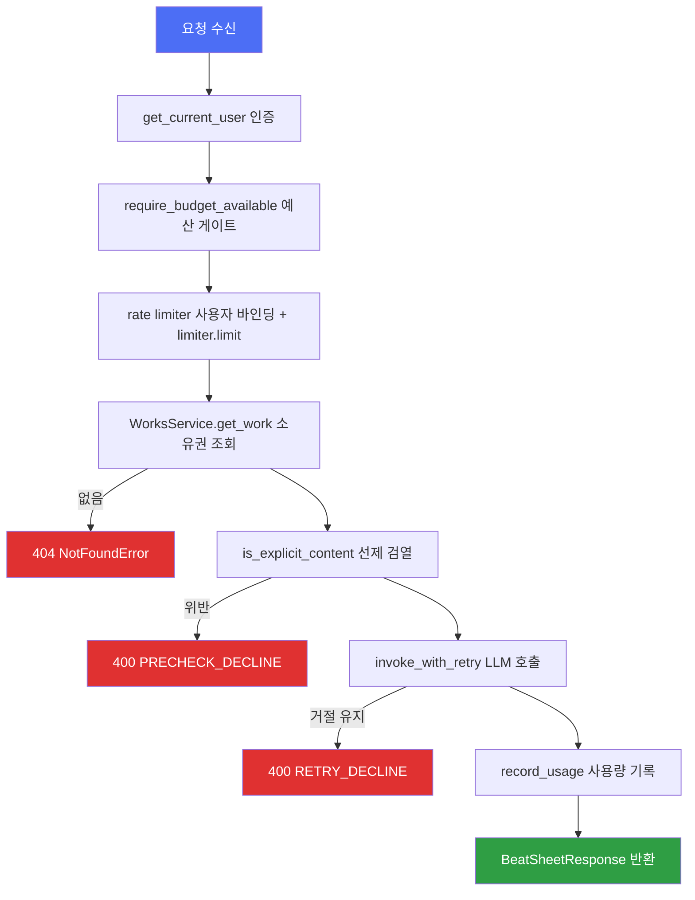

# ARCHITECTURE

## 1. 전체 패턴

모노레포 = `api/`(FastAPI, Python) + `web/`(React 19 SPA). 루트 `Taskfile.yml`이 두 앱을 `api:`/`web:` 네임스페이스로 오케스트레이션하며, 계약 동기화 태스크(`task contract`)로 둘을 잇는다.

- **api**: 라이트 모듈러 모놀리스(DDD 경량). `api/src/domains/<bc>/` 아래 최대 5계층(`router/service/repository/models/schemas`)으로 자기 완결. 일부 경량 도메인(2절 참고)은 이 중 일부만 가진다.
- **web**: TanStack Router 파일 기반 라우팅 + 기능 단위(`web/src/features/<도메인>/`) 구조. 서버 상태는 생성된 TanStack Query 훅, 클라이언트 상태는 Zustand.
- 두 앱은 OpenAPI 스펙 파일(`docs/openapi.json`)로만 연결된다 — 코드 레벨 공유 없음(6절).

## 2. 백엔드 계층 구조와 책임

`works` 도메인(`api/src/domains/works/`)을 기준으로 실제 코드에서 확인한 계층 책임:

- **router** (`router/works_router.py`) — HTTP 경계. `Depends(get_current_user)`로 인증, `Depends`로 서비스·리포지토리를 조립(`_get_service`), `AppError`를 `HTTPException`으로 변환(`_raise_http`), ORM 모델을 프론트 목업 계약(camelCase) `WorkResponse`로 매핑. LLM을 호출하는 엔드포인트(`generate_beat_sheet`)는 여기서 rate-limit·budget·moderation 게이트를 조립한다(3절).
- **service** (`service/works_service.py`) — 비즈니스 로직. `user_id: uuid.UUID`만 받고 `domains.auth`의 `User` 모델을 들이지 않는다(파일 상단 주석: "auth User 모델을 도메인 경계 안으로 들이지 않는다"). 소유권 위반은 `NotFoundError`(404)로만 표현 — 교차 테넌트 존재 여부를 노출하지 않는다.
- **repository** (`repository/works_repository.py`) — SQLAlchemy 쿼리. 모든 조회가 `user_id`로 스코프(`get_owned`, `list_by_user`). `add`는 `session.add`+`flush`만 하고 커밋은 하지 않는다 — 커밋은 `core/database.py`의 `get_async_session` 의존성이 요청 단위로 수행.
- **models** (`models/works_models.py`) — `core.database.Base`를 상속하는 SQLAlchemy 모델. `Work`는 소유 루트(`user_id` FK)이고 하위 도메인 테이블은 `work_id` FK로 격리 뿌리를 삼는다.
- **schemas** (`schemas/works_schemas.py`) — Pydantic 요청/응답, 프론트 `web/src/features/shared/types.ts` 계약에 맞춘 필드명.

마이그레이션(`api/alembic/env.py`)은 도메인이 서로를 import하지 않는 대신, `env.py` 자신이 각 도메인의 `models` 모듈을 `# noqa: F401`로 명시적으로 import해 `core.database.Base.metadata`에 테이블을 등록시킨 뒤 `alembic revision --autogenerate`를 돌린다 — 도메인 간 결합 없이 스키마 전체를 한 곳(`env.py`)에서만 알게 하는 지점.

**원고 계층 — 문서와의 실제 차이** — `api/src/domains/manuscript/models/manuscript_models.py`가 확인해 주는 실제 테이블 구조는 `Work` → `Synopsis`(1:1) / `Episode`(부, `episodes` 테이블) → `Chapter`(화, `chapters` 테이블, `body`·`global_seq` 보유)이다. `scenes` 테이블은 없다 — 모델 파일 주석이 "scenes 테이블은 폐지 — 챕터가 집필·AI 생성의 최소 단위로 흡수"라고 명시하며, 이는 `.forge/adr/260716-17a-remove-scene-collapse-into-chapter.md`로 결정된 사항이다. 다만 타임라인 링크 테이블명은 이 통합 이전 이름인 `scene_entity_links`(컬럼은 `chapter_id`)로 남아 있다(`timeline/models/timeline_models.py`) — 테이블명과 현재 도메인 어휘가 어긋나는 지점이므로 마이그레이션/쿼리 작성 시 주의.

**경량 도메인** — `budget/`, `moderation/`, `image_generation/`은 `service/`만(테이블 없음), `conflicts/`·`relationships/`는 `router/schemas/service/`만 갖고 자체 모델·리포지토리가 없다(다른 도메인의 서비스 데이터를 읽어 파생 결과를 계산). `chat/`은 5계층에 더해 `ports.py`(포트 인터페이스)·`container.py`·`llm_client.py`·`llm_factory.py`를 추가로 가진 가장 두꺼운 도메인이다(4절).

**리소스 중첩 깊이** — `api/src/main.py`의 `_register_routers()`가 등록하는 프리픽스로 실제 URL 트리를 확인할 수 있다:
- `/api/v1/works` — works 도메인 루트(작품 CRUD, 비트 시트)
- `/api/v1/works/{work_id}/synopsis` — manuscript(시놉시스)
- `/api/v1/works/{work_id}/entities`, `.../entities/{entity_id}/timeline-states` — worldbible, timeline
- `/api/v1/works/{work_id}/chapters/{chapter_id}/links`, `.../memory`, `.../assist`, `.../extract-updates` — timeline 링크, memory 검색, assist(집필 보조), dynamic_update(설정 후보 추출)이 모두 챕터 하위 리소스로 중첩
- `/api/v1/works/{work_id}/conflicts`, `.../relationships` — 경량 도메인
- `/api/v1/works/{work_id}/chat` — 작품 단위 채팅(ADR-0010), `/api/v1/chat`(전역 채팅)과 별도 라우터(`chat_router.work_router`)

즉 works가 사실상 모든 하위 도메인의 URL 네임스페이스 루트이며, 이는 2절의 "work_id로 격리 뿌리를 삼는다"는 모델 레벨 규칙이 라우팅 레벨에도 그대로 반영된 것이다.

## 3. 요청 처리 흐름 — LLM 게이트 체인 예시

`POST /api/v1/works/{work_id}/beat-sheet`(`works_router.py:generate_beat_sheet`)는 분기가 많은 대표 사례다(동일 게이트 구성이 `assist_router.py`, `dynamic_update_router.py`에도 재사용됨, 코드 주석 확인). 순서: 인증 → 예산 확인(`require_budget_available`) → 레이트리밋 사용자 바인딩 → `@limiter.limit` 데코레이터 적용 → 작품 조회 → 1차 선제 검열(`is_explicit_content`) → LLM 호출(거절 시 완화 프롬프트로 1회 재시도, `invoke_with_retry`) → 사용량 기록(`record_usage`) → 응답. 두 지점(선제 검열, 재시도 후 거절)에서 400으로 조기 종료하는 분기가 있어 Mermaid로 표현한다.

일반 CRUD 엔드포인트(`list_works`/`get_work`/`update_work`/`delete_work`)는 이 게이트 없이 `인증 → 서비스 호출(소유권 스코프) → 응답 매핑`의 단순 선형 흐름이다.

## 4. 핵심 추상화

- **LLM 포트/어댑터** (`api/src/domains/chat/ports.py`) — `LLMClientProtocol`(구조적 프로토콜), `LLMClientFactoryProtocol`, `AbstractLLMPort`(명시적 ABC). 챗 서비스는 구현체가 아니라 이 인터페이스에만 의존(헥사고날 아키텍처). 실제 `ChatLiteLLM` 생성은 `api/src/infra/llm/provider_factory.py`의 `make_chat_litellm()` 한 곳뿐 — 프로바이더 전환은 `.env`의 `LLM_PROVIDER`만 바꾸면 된다(`api/src/core/config.py`의 `LLMSettings.as_litellm_kwargs`).
- **품질 티어 라우팅** (`api/src/domains/assist/tier_routing.py`) — `TaskType`(continue/infill/dialogue/style/correct/title) → `Tier`(low_cost/high_quality) → `get_client_for_tier()`가 `domains.chat.container.get_llm_factory`로 클라이언트를 해석. 현재는 단일 프로바이더라 두 티어가 같은 클라이언트로 수렴(코드 주석에 명시).
- **공통 예외 계층** (`api/src/core/exceptions.py`) — `AppError` 및 `NotFoundError`/`ConflictError`/`UnauthorizedError`/`ForbiddenError`. 서비스가 던지고 라우터가 `HTTPException`으로 변환(`_raise_http` 패턴, works_router 등 반복).
- **인증/인가** (`api/src/domains/auth/security.py`) — Bearer-only JWT(액세스 15분·리프레시 7일, `jti` 클레임), 로그아웃 시 `jti`를 Redis 블랙리스트에 저장해 매 요청마다 조회, `passlib[argon2]` 비밀번호 해시. `require_permission(key)` 의존성 팩토리로 RBAC를 적용하고, `get_current_user`가 전 도메인 라우터가 공유하는 인증 진입점이다.
- **DDD 스캐폴딩 — 정의는 되어 있으나 미사용** (`api/src/domains/shared/base.py`, `events.py`, `types.py`) — `Entity`/`AggregateRoot`/`ValueObject` 데이터클래스, `DomainEventBus`(인프로세스 pub/sub), `NewType` ID 별칭(`UserId` 등)이 정의돼 있지만, `domains/shared/__init__.py`와 각 파일 자신의 예시 외에는 어떤 도메인 모듈에서도 import되지 않는다(grep 확인). 실제 모델은 모두 `core.database.Base`를 직접 상속하고, 실제 도메인 간 통신은 이벤트 버스가 아니라 서비스 객체 직접 의존(9절)으로 이뤄진다.

## 5. 엔트리포인트

- **api** — `api/src/main.py`의 `create_app()`이 미들웨어(`CorrelationIdMiddleware`→CORS)·예외 핸들러·레이트리미터 상태를 등록하고 `_register_routers()`가 도메인별 라우터를 `try/except ImportError`로 하나씩 `/api/v1` 프리픽스로 mount한다(도메인이 아직 없어도 앱이 뜨도록 하는 점진 도입 패턴). `lifespan()`이 기동 시 Redis 커넥션을 워밍하고, 임베딩 모델은 `asyncio.to_thread`가 아니라 데몬 스레드로 별도 워밍(리로드 시 셧다운이 블록되지 않게 하려는 명시적 이유가 주석에 있음). `/health`·`/ready`는 인증 없이 노출.
- **web** — `web/src/main.tsx` → `RouterProvider(router)`(`web/src/lib/router.ts`). 루트 라우트(`web/src/routes/__root.tsx`)가 `AppProviders`(TanStack `QueryClientProvider` + `api-interceptors` 부작용 import)로 전체를 감싸고, `SessionRestore` 컴포넌트가 마운트 시 저장된 accessToken이 있으면 `/me`로 세션을 복구한다. 루트 라우트 자체는 인증 리다이렉트를 하지 않는다 — `/`(`routes/index.tsx`)는 인증 여부와 무관하게 공개 마케팅 랜딩(`LandingScreen`)을 렌더링하고, 보호가 필요한 개별 라우트가 각자 `beforeLoad: () => requireAuth('/works')`(`features/auth/lib/guard.ts`)를 호출한다(예: `routes/works/index.tsx`).

## 6. 백엔드 ↔ 프론트엔드 경계 — API 계약 파이프라인

계약은 코드 우선(code-first, ADR-0006)이다. 5단계 선형 파이프라인:

FastAPI 라우터·Pydantic 스키마 정의(`api/src/domains/**`) → `app.openapi()` 호출(`api/scripts/export_openapi.py`, DB/Redis 연결 없이 스키마만 조립) → 루트 `docs/openapi.json`에 저장 → `web`에서 `pnpm generate`(`@hey-api/openapi-ts`, 설정 `web/openapi-ts.config.ts`, input `../docs/openapi.json`) 실행 → `web/src/api/`에 타입(`types.gen.ts`)·SDK(`sdk.gen.ts`)·TanStack Query 훅(`@tanstack/react-query.gen.ts`)이 재생성.

루트에서는 `task contract`(= `api:openapi` + `web:generate`)와 검증까지 포함한 `task contract-check`로 이 파이프라인을 한 번에 실행한다.

소비 측 규약: 기능 도메인은 생성 SDK를 직접 쓰지 않고 `features/<도메인>/api/*.api.ts` 파사드로 감싼다(예: `web/src/features/works/api/works.api.ts` — `throwOnError: true`로 성공 데이터만 반환하는 `worksApi`, 그리고 `worksQueries`/`worksMutations`로 재노출). HTTP 클라이언트 설정은 `web/src/lib/api-client.ts`(dev는 빈 baseURL → Vite 프록시가 `:8000`으로 전달, `web/vite.config.ts`), 인증 헤더 주입과 401 시 single-flight 토큰 갱신·재시도는 `web/src/lib/api-interceptors.ts`(axios 인터셉터, `createRefreshCoordinator`)가 담당한다.

## 7. 프론트엔드 상태 관리 구조

- **서버 상태** — TanStack Query. 훅은 생성 코드(`web/src/api/@tanstack/react-query.gen.ts`)에서 나오고, 기능별 파사드(`worksQueries` 등)가 재노출한다.
- **클라이언트 상태** — Zustand. 두 가지 하위 패턴이 혼재한다:
  - **영속 스토어**: `persist` 미들웨어. 인증 세션(`web/src/features/auth/store/auth.store.ts`, 키 `sw-auth-v3`), 설정(`web/src/features/settings/store/settings.store.ts`, 키 `sw-settings`).
  - **불변성 스토어**: `immer` 미들웨어(`web/src/features/admin/store/admin.store.ts`).
- **서버→클라이언트 하이드레이션 패턴** — `works`/`world-bible`/`timeline` 도메인은 TanStack Query로 실 API를 호출한 뒤 결과를 단일 Zustand 스토어(`web/src/features/shared/store/works.store.ts`)에 밀어 넣는 훅(`useHydrateWorks`, `web/src/features/works/lib/hydrate-works.ts`; `useWorkEntities`, `world-bible/lib/hydrate-entities.ts`)을 라우트 레이아웃(`web/src/routes/works/$workId.tsx`)에서 호출한다 — 이후 화면 트리는 쿼리가 아니라 이 Zustand 스토어를 단일 소스로 읽는다. 단, `works.store.ts`는 아직 `features/shared/mock/works.ts`의 `seedUsage`(사용량 통계 등 미구현 필드)도 함께 사용한다 — 실 API 필드와 목업 필드가 한 스토어 안에 공존.
  admin 도메인은 아직 완전히 목업(`features/admin/mock/members.ts`의 `seedMembers`를 스토어 초기값으로 사용, 실 API 없음).
- **UI 오버레이 상태** — `web/src/stores/modal-store.ts`(전역 모달 매니저, 기능 스토어와 분리).

## 8. 횡단 관심사

- **상관관계 ID·로깅** (`api/src/core/middleware.py`) — `CorrelationIdMiddleware`가 `X-Correlation-ID`를 읽거나 생성해 `structlog.contextvars`에 바인딩하고 응답 헤더에도 되돌려 준다. 이후 요청 처리 중의 모든 `structlog` 로그가 이 ID를 자동으로 포함한다.
- **사용자별 레이트리밋** (`api/src/core/rate_limit.py`) — `slowapi.Limiter`, 키 함수 `_get_user_key`는 `request.state.user`(각 라우터가 `Depends`로 미리 채움)가 있으면 `user:{id}`로, 없으면 원격 IP로 버킷팅. `key_style="endpoint"`를 명시해 `work_id`/`chapter_id`로 파라미터화된 경로가 URL별로 쪼개지지 않고 (사용자, 액션 종류) 단위로 합산되게 한다. 스토리지는 인메모리(단일 워커 전제, `core/config.py`의 `workers: int = 1`과 일치) — 멀티 워커로 갈 경우 `storage_uri=settings.redis_dsn` 전환이 필요하다고 주석에 명시.
- **LLM 호출 로그 컨텍스트** (`api/src/core/llm_call_context.py`) — `ContextVar` 기반 `LLMCallContext(user_id, task)`. `assist`·`chat`·`dynamic_update`·`works`·`relationships` 5개 도메인 라우터가 `bind_llm_call_context()`로 채우면, `chat/llm_client.py`의 `LLMClient`가 읽어 `llm_call_logs` 테이블(`chat/models/llm_call_log.py`)에 기록한다. `correlation_id`는 여기서 다루지 않고 위 structlog contextvars에서 별도로 가져간다.

## 9. 도메인 간 의존 규칙

**백엔드** — "도메인 간 직접 DB 모델 import 금지"(`api/CLAUDE.md`)가 실제로 지켜지는 방식을 모델 파일 주석에서 확인:
- 외래키는 **테이블명 문자열**로만 선언(`ForeignKey("works.id", ...)`)하고 대상 도메인의 ORM 클래스는 import하지 않는다(`manuscript_models.py`, `worldbible_models.py`, `timeline_models.py`에 동일 문구 반복).
- **다형적 참조**가 필요한 경우(임베딩이 엔티티 또는 챕터를 가리킴) FK 자체를 걸지 않고 `source_type`/`source_id` 판별 컬럼으로 대체한다(`memory/models/memory_models.py`의 `Embedding`) — "애초에 도메인 간 직접 모델 import 금지 컨벤션과도 맞음"이라고 명시.
- 대신 **서비스 객체 간 의존은 허용되고 실제로 널리 쓰인다**: `MemorySearchService`(`memory/service/memory_search_service.py`)는 생성자에서 `WorldBibleService`·`ManuscriptService`·`TimelineService`를 직접 받는다. 라우터 레벨에서도 타 도메인 인터페이스를 자유롭게 가져온다 — `works_router.py`는 `domains.auth.security.get_current_user`, `domains.budget.dependency/service`, `domains.chat.ports.AbstractLLMPort`, `domains.moderation.service`, `domains.assist.tier_routing`을 직접 import한다. 즉 금지 대상은 "ORM 모델 클래스"이지 서비스/포트/의존성 함수가 아니다.
- `domains/shared/events.py`의 `DomainEventBus`는 이런 결합을 이벤트로 느슨하게 하려는 의도로 보이지만, 4절에서 확인했듯 실제 구독자가 없어 현재는 사실상 미사용 상태다.

**프론트엔드** — 기능 간 경계는 툴링(Biome)으로 강제되지 않는다(`web/biome.json`의 `linter.rules`는 `recommended: true`뿐, import 제한 규칙 없음). 대신 관례로: 도메인 공통 타입(`web/src/features/shared/types.ts`)과 공유 스토어(`web/src/features/shared/store/works.store.ts`, `selectors.ts`)를 여러 기능(`works`/`world-bible`/`editor`/`timeline`)이 함께 읽고 쓴다 — 즉 `shared`가 사실상의 공유 커널이고, 개별 기능끼리 서로의 `components/`를 직접 참조하는 사례는 관찰되지 않았다.
