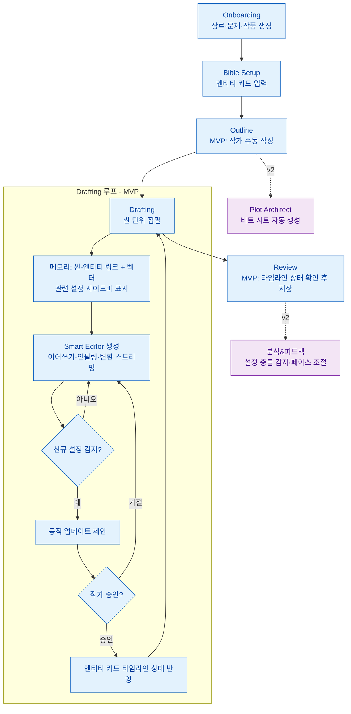

# PRD: StoryWeaver (가칭) — v2

**AI 기반 웹소설 창작 코파일럿(Co-pilot) SaaS 플랫폼**

> 본 문서는 루트의 `기획.md`를 정교화한 PRD v2다. 확정된 핵심 결정(상업용 멀티테넌시 SaaS, MVP 범위 한정, 상용 LLM 하이브리드 + 전체이용가 수위, Python/React 이원 스택, 하이브리드 메모리)을 일관되게 반영한다. 관련 결정 근거는 `.forge/adr/0001~0003`을, 용어 정의는 `.forge/CONTEXT.md`를 따른다.

---

## 1. 개요 (Executive Summary)

- **제품 정의:** 작가가 설정한 세계관과 캐릭터를 AI가 **기억(메모리)** 하고, 집필 전 과정을 보조하는 웹 기반 저작 도구. 모든 설정·플롯·원고는 **작품(Work)** 단위로 소유·격리된다.
- **해결하려는 문제:**
    - 장편 연재 시 발생하는 설정 오류 및 개연성 붕괴 — 특히 "3화에서 죽은 캐릭터가 10화에 등장" 같은 **상태(타임라인 상태) 모순**.
    - 작가의 창작 고갈(Writer's Block) 및 반복 작업으로 인한 피로.
    - 단순 텍스트 생성 툴(ChatGPT 등)의 낮은 문맥 유지력(Long-context) 한계.
- **핵심 가치 (유지):** "기억하는 AI", "장르 문법을 아는 조수", "구조적인 글쓰기".
- **차별점:** 순수 벡터 검색이 주지 못하는 **상태/사실 추적**을 정형 엔티티 카드(타임라인 상태) + 벡터 + 씬-엔티티 링크 하이브리드로 구현한다(ADR-0002). 이것이 v2 설정 충돌 감지 기능의 토대다.
- **비즈니스 모델:** 상업용 SaaS. 멀티테넌시 환경에서 작가(테넌트) 간 데이터가 격리된다.

---

## 2. 타겟 유저 (Target Audience)

1. **메인 타겟:** 웹소설 작가 지망생 및 아마추어 작가 (아이디어는 있으나 필력/끈기가 부족한 층).
2. **서브 타겟:** 다작(多作)을 통해 수익을 창출하려는 프로 웹소설 작가.

타겟 공통 특성: 한국어 장르 웹소설(무협·로판·판타지·회귀물 등) 중심. 따라서 한국어 생성 품질이 모델 선택의 1순위 기준이다(ADR-0003).

> **수위 정책 주의:** 본 제품은 전체이용가(약 15세) 수위를 상한으로 한다(ADR-0003). 19금 성인 웹소설 작가는 타겟이 아니다(6장 비목표 참조).

---

## 3. 기능 우선순위 (Feature Prioritization)

> `기획.md`에는 섹션 번호 5번이 **두 번**(캐릭터 관계도 / 부가 기능) 중복으로 매겨져 있었다. 본 PRD에서는 모든 기능을 단일 우선순위 표로 재정리하여 번호 중복을 제거한다.

확정된 범위 결정: **MVP는 World Bible + 메모리 + Smart Editor의 3개 핵심 영역으로 한정**한다. (여기서 "3"은 이 세 대분류 영역을 가리키며, Smart Editor 내부의 집필 보조 기능 개수와는 무관하다.) Plot Architect·분석&피드백·캐릭터 관계도·이미지 생성은 v2+로 미룬다.

### 3.1. MVP vs v2+ 구분 표

| 우선순위 | 대분류 | 세부 기능 | 비고 |
|---|---|---|---|
| **MVP** | World Bible | 엔티티 카드 (인물/장소/사건/아이템) | 인물 카드: 이름·외모·성격·말투(샘플 대사)·관계 |
| **MVP** | World Bible | 동적 업데이트 제안 (집필 중 신규 설정 감지) | AI가 감지 → 작가 승인 후 카드 반영 |
| **MVP** | 메모리 | 벡터 검색 기반 관련 설정 자동 표시 (사이드바) | 씬-엔티티 링크 1차 + 벡터 유사도 보조 (ADR-0002) |
| **MVP** | 메모리 | 씬-엔티티 링크 | 메모리가 무엇을 불러올지 정하는 1차 근거 |
| **MVP** | 메모리 | 타임라인 상태 기록 | 충돌 감지(v2)의 토대 데이터. MVP에서는 기록·표시까지 |
| **MVP** | Smart Editor | 이어 쓰기 (Continue) | 커서 위치에서 다음 문장 3~5개 추천 |
| **MVP** | Smart Editor | 인필링 (In-filling) | 문장 사이 묘사 자연 연결 |
| **MVP** | Smart Editor | 지문/대사 변환 | "A가 B에게 화내며 거절" → 실제 대사 |
| **MVP** | Smart Editor | 문체 변환 (단어/문장 교정) | "판타지 풍으로", "무협 풍으로" |
| **v2+** | Plot Architect | 계층적 구조 설계 (시놉시스→에피소드→챕터→씬) | |
| **v2+** | Plot Architect | 트리 뷰 (드래그 앤 드롭 순서 변경) | |
| **v2+** | Plot Architect | 비트 시트 자동 생성 | "회귀물 1화 국룰 전개" → 비트 시트 |
| **v2+** | 분석 & 피드백 | 설정 충돌 감지 | 타임라인 상태 기반 모순 경고 |
| **v2+** | 분석 & 피드백 | 페이스 조절 | 대화/서술 빈도 분석, 늘어지는 구간 지적 |
| **v2+** | 캐릭터 관계도 | 기본 관계도 시각화 | |
| **v2+** | 캐릭터 관계도 | 챕터별 관계도 (AI 자동 생성) | `기획.md` 원문: "이왕이면 인공지능이" |
| **v2+** | 이미지 생성 | 캐릭터 설정집 이미지 | |
| **v2+** | 이미지 생성 | 장소 설정집 이미지 | |

> **누락 점검 (기획.md 전 항목 매핑):** 인물 카드(MVP), 동적 업데이트(MVP), 벡터 검색(MVP), 트리 뷰(v2+), 비트 시트(v2+), 이어 쓰기(MVP), 인필링(MVP), 지문/대사 변환(MVP), 문체 변환(MVP), 설정 충돌 감지(v2+), 페이스 조절(v2+), 관계도(v2+), 이미지 생성(v2+) — 13개 항목 전부 반영됨.

### 3.2. MVP 핵심 기능 상세

#### 3.2.1. World Bible (기억 및 설정 관리)
- **기능 정의:** 인물·장소·사건·아이템 등 고유 명사와 설정을 **엔티티 카드**로 저장·관리하는 저장소.
- **상세 요구사항:**
    - **엔티티 카드 (인물):** 이름, 외모, 성격, 말투(샘플 대사), 주요 관계를 정형 필드로 입력.
    - **동적 업데이트 제안:** 집필 중 새로운 설정(예: 주인공이 새 스킬 획득)이 감지되면 AI가 해당 카드 업데이트를 제안하고, 작가 승인 시 반영한다(자동 덮어쓰기 아님).
    - **타임라인 상태 기록:** "3화에서 사망", "5화에서 각성"처럼 시점별 상태를 기록(MVP는 기록·표시까지, 충돌 자동 감지는 v2).

#### 3.2.2. 메모리 (Memory)
- **기능 정의:** 현재 집필 중인 씬과 관련된 World Bible 설정을 찾아 AI에 컨텍스트로 제공.
- **상세 요구사항:**
    - **씬-엔티티 링크 (1차 근거):** 특정 씬에 등장하는 엔티티를 명시적으로 연결.
    - **벡터 검색 (보조):** 링크되지 않은 관련 설정을 의미 유사도로 보충. 저장소는 PostgreSQL + pgvector(ADR-0002).
    - **사이드바 자동 표시:** 현재 씬과 관련된 설정을 에디터 사이드바에 자동 노출.

#### 3.2.3. Smart Editor (집필 및 생성)
- **기능 정의:** 실제 글을 쓰고 AI와 협업하는 에디터.
- **상세 요구사항:**
    - **이어 쓰기 (Continue):** 커서 위치에서 다음 문장 3~5개 추천 생성.
    - **인필링 (In-filling):** 문장과 문장 사이를 자연스럽게 연결하는 묘사 추가.
    - **지문/대사 변환:** "A가 B에게 화내며 거절하는 내용" → 실제 소설 대사로 변환.
    - **문체 변환:** "판타지 풍으로", "무협 풍으로" 등 단어/문장 교정.
- **모델 스위칭:** 작업 종류별로 저비용/고품질 LLM을 골라 호출한다(ADR-0003). 예: 이어쓰기는 저비용, 문체 변환·구조 생성(v2)은 고품질.

---

## 4. 비기능 요구사항 (Non-Functional Requirements)

상용 SaaS이자 LLM 비용에 종속되는 제품이므로, 아래 NFR은 기능 요구사항과 동등한 우선순위를 갖는다. 수치 목표 중 일부는 출시 전 부하 테스트로 확정해야 하는 **미결정** 항목이다.

### 4.1. 토큰 비용 한도 (Cost Control)
- 토큰 비용이 상용 API 단가에 종속되므로(ADR-0003), **사용자별 비용 한도(budget)** 와 **호출 빈도 제한(rate limit)** 을 반드시 설계한다.
- **Budget:** 사용자/요금제별 월간 토큰 또는 비용 상한. 초과 시 생성 차단 및 안내.
- **Rate:** 단위 시간당 생성 요청 수 제한(어뷰징·폭주 방지).
- **모델 스위칭:** 작업별 저비용/고품질 모델 분기로 평균 단가를 낮춘다.
- 구체 한도 수치(요금제별 토큰량, 단가 마진): **미결정** (요금제 설계 시 확정).

### 4.2. 응답 지연시간 (Latency)
- 집필 보조는 체감 즉시성이 핵심이므로 **스트리밍**을 기본으로 한다.
- **TTFT(Time To First Token):** 사용자가 생성 요청 후 첫 토큰까지의 시간을 핵심 지표로 관리. 목표 수치: **미결정** (상용 API 응답 특성 + 부하 테스트로 확정).
- 프론트-백엔드 간 스트리밍 API 계약을 명시적으로 설계·유지한다(ADR-0001 Consequences).

### 4.3. 저작권 (Copyright / IP)
- **생성물 귀속:** AI 생성 텍스트의 최종 저작물 귀속은 작가(사용자)에게 둔다. 약관에 명시.
- **작가 원고 비학습 약정:** 작가가 입력한 원고·설정을 모델 학습에 사용하지 않음을 약정한다. 상용 API 호출 시에도 학습 옵트아웃 설정을 사용한다.
- **학습 데이터:** 자체 학습은 비목표(6장). 상용 API의 학습 데이터 정책은 제공사 약관에 종속됨을 고지.
- 세부 약관 문구: **미결정** (법무 검토 필요).

### 4.4. 데이터 주권 / 개인정보 (Data Sovereignty / Privacy)
- 원고·설정은 작가의 민감 자산이므로 테넌트 데이터로 보호한다.
- 데이터 저장 리전, 개인정보 처리방침, 보관/삭제 정책: **미결정** (개인정보보호법/법무 검토 필요).
- 상용 LLM API로 전송되는 데이터의 범위·보존 정책을 사용자에게 고지한다.

### 4.5. 멀티테넌시 격리 (Multi-tenancy Isolation)
- 상용 SaaS이므로 테넌트(작가) 간 데이터 격리는 필수.
- 모든 데이터 접근은 **작품(Work)** → 소유 테넌트 단위로 스코프된다. 메모리/벡터 검색 결과가 타 테넌트 데이터를 절대 반환하지 않도록 쿼리 격리.
- 격리 구현 방식(스키마 분리 vs row-level 격리): **미결정** (아키텍처 설계 슬라이스에서 확정).

### 4.6. 가용성 (Availability)
- 상용 SaaS 가동 목표(SLA), 상용 API 장애 시 폴백/대체 모델 동작, 생성 실패 재시도 정책: **미결정**.
- 상용 API 의존이 단일 장애점이 되지 않도록 하이브리드(다중 제공사) 구성을 고려한다(ADR-0003).

### 4.7. 콘텐츠 모더레이션 처리
- 무협 살육·복수극 잔혹 묘사 등 일부 장르 표현이 상용 API 모더레이션에 걸릴 수 있다(ADR-0003 Consequences).
- 모더레이션 거절 시 사용자 대면 **완곡한 거절 안내**를 제공한다(생성 실패를 시스템 오류로 노출하지 않음).

---

## 5. 사용자 시나리오 (User Flow)

신규 작가가 작품을 시작해 1화 초고를 완성하기까지의 흐름이다. MVP 범위(World Bible·메모리·Smart Editor)만으로 구성하며, Outline/Review의 일부는 MVP에서 수동(작가 주도)으로 진행되고 AI 구조 설계(Plot Architect)·자동 충돌 감지는 v2에서 보강된다.

1. **Onboarding:** 장르(무협·로판 등)와 기본 문체 선택, 새 **작품(Work)** 생성.
2. **Bible Setup:** 주인공 이름, 핵심 목표, 조력자 등 **엔티티 카드** 입력(World Bible 구성).
3. **Outline(MVP 수동):** 작가가 1~5화 분량의 개요를 직접 작성. (AI 비트 시트 자동 생성은 v2 Plot Architect.)
4. **Drafting:** 씬(Scene) 단위로 집필.
   - 에디터가 현재 씬의 **씬-엔티티 링크 + 벡터 검색**으로 관련 설정을 사이드바에 표시(메모리).
   - 작가가 이어 쓰기·인필링·지문/대사 변환·문체 변환을 호출(Smart Editor, 스트리밍 생성).
   - 신규 설정 발생 시 AI가 **동적 업데이트 제안** → 작가 승인 → 엔티티 카드/타임라인 상태 반영.
5. **Review(MVP 부분):** 작가가 타임라인 상태를 확인하며 검토 후 저장. (자동 설정 충돌 감지·페이스 조절은 v2 분석&피드백.)

---

## 6. 비목표 (Non-Goals)

본 제품이 **명시적으로 다루지 않는** 범위다.

1. **19금 성인 웹소설(고수위 성인물):** 콘텐츠 수위 상한은 전체이용가(약 15세)다(ADR-0003). 성인물 진입은 모델·정책·연령인증을 별도 ADR로 재설계해야 하는 별개 사안이며 현재 비목표.
2. **MVP 비포함 기능:** Plot Architect(트리 뷰·비트 시트), 분석&피드백(설정 충돌 자동 감지·페이스 조절), 캐릭터 관계도, 이미지 생성은 MVP 범위가 아니다(v2+).
3. **자체 LLM 모델 호스팅:** 상용 API 하이브리드를 사용한다. 자체 호스팅 오픈소스 모델은 GPU 비용·한국어 품질 리스크로 MVP에 과하다(ADR-0003 Considered Options).

---

## 부록: 관련 결정 (Reference)

- ADR-0001: Python(FastAPI) 백엔드 + React/TypeScript 프론트 이원 스택.
- ADR-0002: 하이브리드 메모리 (정형 엔티티 카드 + 타임라인 상태 + 벡터(pgvector) + 씬-엔티티 링크).
- ADR-0003: 상용 LLM API 하이브리드 + 전체이용가 콘텐츠 수위, 모델 스위칭, 비용 한도 설계 필요.
- 용어: `.forge/CONTEXT.md` (작품/World Bible/엔티티 카드/타임라인 상태/씬/씬-엔티티 링크/메모리/모델 스위칭).
