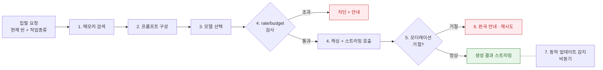
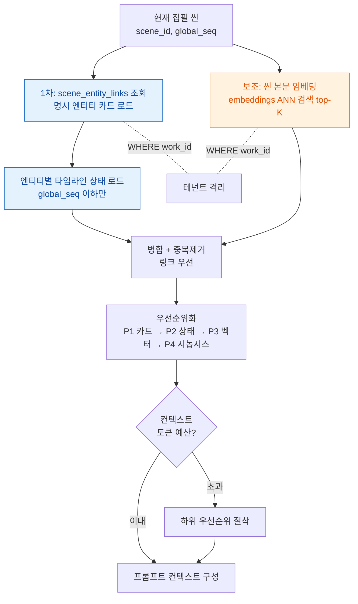
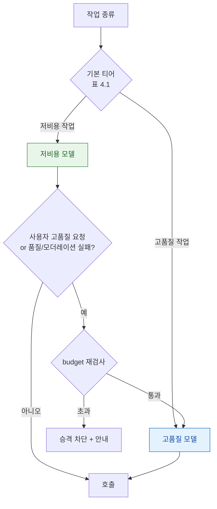
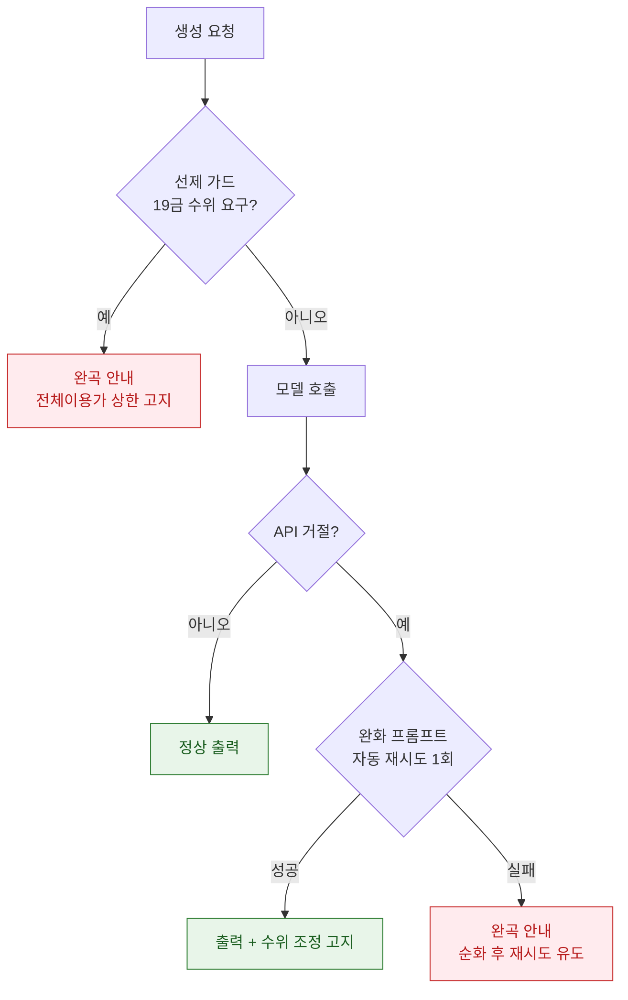
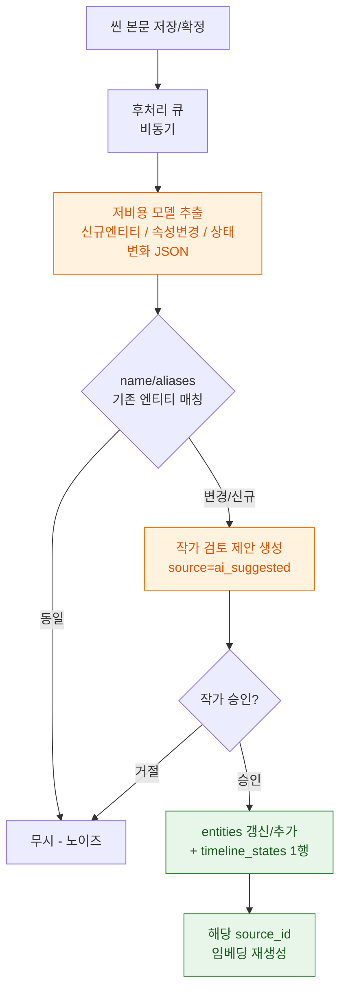

# AI/RAG 파이프라인 설계

**StoryWeaver — 메모리 검색 + 프롬프트 전략 + 모델 스위칭 + 비용 통제 (슬라이스 S4)**

> 본 문서는 ADR-0002(하이브리드 메모리)와 ADR-0003(상용 LLM 하이브리드 + 전체이용가 수위 + 모델 스위칭)을 집필 기능 단위의 실행 파이프라인으로 구체화한다. 데이터 스키마는 `docs/data-model.md`(테이블명·필드명을 그대로 참조), 기능 범위는 `docs/PRD.md`, 용어는 `.forge/CONTEXT.md`의 canonical 정의를 따른다.
>
> 범위 경계: 본 문서가 다루는 집필 기능은 **MVP Smart Editor 3종 + 동적 업데이트**다. 구체적으로 이어쓰기(Continue)·인필링(In-filling)·지문/대사 변환·문체 변환·단어/문장 교정, 그리고 동적 업데이트(집필 중 신규 설정 감지 → 엔티티 카드 갱신 제안). Plot Architect(비트 시트)·분석&피드백(자동 충돌 감지)·관계도·이미지 생성은 v2+이므로 본 문서의 모델 스위칭 표에 v2 행으로만 표기하고 상세 설계는 하지 않는다.
>
> 수치(토큰 예산, 모델 ID, 임베딩 차원, 한도값 등)는 상당수가 **미결정**이며 그렇게 명시한다. 본 문서가 고정하는 것은 **구조와 규칙**이다.

---

## 1. 파이프라인 개관 (Overview)

집필 보조 한 번의 요청은 다음 레인을 거친다.

1. **메모리 검색 (Memory Retrieval):** 현재 씬을 기준으로 (1) 씬-엔티티 링크로 명시 엔티티 카드를 로드하고 (2) 벡터 유사도로 관련 설정을 보충 → 병합·중복제거·토큰예산 내 우선순위화 → 컨텍스트 구성. (2장)
2. **프롬프트 구성 (Prompt Assembly):** 작업 종류(이어쓰기/인필링/변환/교정)별로 입력 구성과 시스템 프롬프트를 조립한다. (3장)
3. **모델 선택 (Model Switching):** 작업 종류·길이·품질요구에 따라 저비용/고품질 모델을 고른다. (4장)
4. **호출 + 비용 통제 (Invoke & Cost Control):** rate/budget 검사 → 캐싱 적용 → 스트리밍 호출. (5장)
5. **모더레이션 처리 (Moderation):** 상용 API가 거절하면 사용자 대면 완곡 안내·재시도. (6장)
6. **동적 업데이트 (Dynamic Update):** 생성/집필 결과에서 신규 설정을 감지해 엔티티 카드 갱신을 제안. (7장)



---

## 2. 하이브리드 메모리 검색 흐름

메모리 검색의 목적은 "현재 씬을 잘 쓰기 위해 AI가 알아야 할 World Bible 설정"을 토큰 예산 안에 채워 넣는 것이다. ADR-0002에 따라 **씬-엔티티 링크가 1차 근거, 벡터 유사도는 보조**다. 두 경로 모두 `work_id`로 선필터되어 타 테넌트 데이터를 절대 반환하지 않는다(데이터 모델 7장).

### 2.1. 단계별 절차

입력은 현재 집필 중인 씬 `scene_id`(+ 필요 시 커서 주변 텍스트)와 작업 종류다.

1. **(1차) 명시 엔티티 로드:** `scene_entity_links`에서 `scene_id`에 연결된 `entity_id`를 모두 가져와 해당 `entities`(엔티티 카드) + 각 엔티티의 **현재 시점 이전까지의 타임라인 상태**를 로드한다. "현재 시점"은 씬의 `global_seq`이며, `timeline_states`를 `scenes.global_seq <= 현재 씬 global_seq` 조건으로 필터해 미래 상태가 새지 않게 한다(스포일러/시점 역행 방지).
2. **(보조) 벡터 유사도 검색:** 현재 씬 본문(또는 커서 주변 청크)을 임베딩해 `embeddings` 테이블에서 ANN 검색으로 상위 K개 청크를 가져온다(`work_id` 선필터). 결과의 `source_type`/`source_id`로 원본 엔티티/씬을 역참조한다. 1차에서 이미 로드된 엔티티는 여기서 제외 후보다.
3. **병합 + 중복제거:** 1차 결과와 보조 결과를 합치고 `entity_id`/청크 단위로 중복을 제거한다. 같은 엔티티가 양쪽에 있으면 1차(링크)를 우선한다.
4. **우선순위화 (토큰 예산 내):** 아래 우선순위로 정렬해 컨텍스트 토큰 예산(5.1)을 채운다. 예산 초과분은 절삭한다.
   - P1: 씬-엔티티 링크된 엔티티의 카드 핵심 필드(`name`, `summary`, 인물의 `speech_style`/`sample_lines`).
   - P2: 그 엔티티들의 유효 타임라인 상태(현재 시점까지).
   - P3: 벡터 유사도 상위 청크(보조 설정).
   - P4: 시놉시스 요약·장르/문체 메타(작품 레벨, 항상 짧게 포함).
5. **컨텍스트 구성:** 우선순위화된 조각을 작업별 프롬프트 템플릿(3장)의 컨텍스트 슬롯에 직렬화한다.

> **미결정:** 벡터 검색 상위 K, 1차/보조 토큰 배분 비율, 커서 주변 윈도 크기, 매칭 시 엔티티 `name`/`aliases` 매칭 알고리즘(정확/형태소/임베딩 — 데이터 모델 3.1·5.1과 동일하게 미결정).

### 2.2. 검색 흐름도



---

## 3. 작업별 프롬프트 전략

모든 작업의 시스템 프롬프트는 공통 베이스를 공유한 뒤 작업별 지시를 덧붙인다. 공통 베이스는 (a) 역할(웹소설 집필 보조), (b) 작품의 장르·문체(`works.genre`/`works.style`), (c) 전체이용가(약 15세) 수위 준수(ADR-0003), (d) 메모리 컨텍스트(2장)는 "사실 근거"이며 모순되게 쓰지 말 것 — 을 포함한다.

> 아래 시스템 프롬프트는 **골자(요지)**이지 최종 문구가 아니다. 정확한 워딩·few-shot 예시는 프롬프트 튜닝에서 확정(**미결정**).

### 3.1. 작업별 입력 구성 · 시스템 프롬프트 골자

| 작업 | 사용자 입력 | 메모리 컨텍스트 주입 | 시스템 프롬프트 골자 | 출력 형태 |
|---|---|---|---|---|
| **이어쓰기 (Continue)** | 커서 직전 본문(앞 N토큰) | 2장 풀세트(P1~P4) | 직전 흐름을 이어 **다음 문장 3~5개 후보**를 장르·문체에 맞게 생성. 컨텍스트의 설정·상태와 모순 금지. 후보는 서로 다른 전개로. | 후보 3~5개(스트리밍) |
| **인필링 (In-filling)** | 앞 문장 + 뒤 문장(빈 구간 양끝) | 2장 풀세트 | 앞·뒤 문장 사이를 자연스럽게 잇는 **묘사/연결 문장**을 채움. 양끝 문장을 다시 쓰지 말고 사이만 생성. 톤 일치. | 삽입 문장 1~수개 |
| **지문/대사 변환** | 작가의 의도 서술(예: "A가 B에게 화내며 거절") | 2장 풀세트 + 등장 인물의 `speech_style`/`sample_lines` **강조** | 의도 서술을 실제 **소설 대사+지문**으로 변환. 해당 인물의 말투(`sample_lines`)를 모사. 메타 설명 없이 본문만. | 변환된 대사·지문 |
| **문체 변환** | 변환 대상 텍스트(선택 블록) + 목표 문체(판타지/무협 등) | 카드 핵심(P1)만 경량 주입 + 작품 `style` | 의미·사건은 보존하고 **어휘·어조·문장 리듬만** 목표 문체로 재작성. 고유명사·설정 보존. | 재작성된 텍스트 |
| **단어/문장 교정** | 교정 대상 텍스트(선택 블록) | 메모리 주입 **최소**(고유명사 보존용 `name`/`aliases`만) | 맞춤법·어색한 표현·중복 어휘를 **최소 침습**으로 교정. 의미·문체·고유명사 변경 금지. | 교정된 텍스트(+ 선택적 변경점) |

설계 근거(요지):
- **이어쓰기/인필링**은 서사 일관성이 생명이므로 메모리 풀세트(특히 타임라인 상태)를 넣어 "죽은 인물이 멀쩡히 등장" 같은 생성 모순을 입력 단계에서 줄인다.
- **지문/대사 변환**은 인물 말투 재현이 품질의 핵심이라 `speech_style`/`sample_lines`를 별도 강조 슬롯에 둔다.
- **문체 변환/교정**은 입력 텍스트가 이미 사실을 담고 있어 설정 주입을 줄이고(토큰 절약), 대신 "고유명사·설정 보존"을 강제한다 — 교정이 설정을 바꾸면 안 되기 때문.

### 3.2. 프롬프트 조립 흐름

요청 → 작업 종류 분기 → (작업별 메모리 주입 수준 결정) → 공통 베이스 + 작업별 지시 + 컨텍스트 직렬화 → 모델 선택(4장)으로 전달.

```
요청(작업종류 + 사용자입력)
   → 메모리 검색(2장, 작업별 주입수준 반영)
   → 공통 시스템 베이스(역할·장르·수위·근거규칙)
   → 작업별 시스템 지시 + 입력 슬롯 채움
   → 조립된 프롬프트
```

---

## 4. 모델 스위칭 규칙

ADR-0003의 모델 스위칭을 작업 단위 규칙으로 고정한다. 원칙: **저지연·고빈도·낮은 추론난도 작업은 저비용 모델, 품질·창의성·말투 재현이 결정적인 작업은 고품질 모델.** 하이브리드(복수 제공사)로 구성해 단일 제공사 장애·정책 거절에 대비한다(ADR-0003).

> **미결정:** 실제 모델 ID·티어 매핑(어떤 제공사의 어떤 모델을 저비용/고품질로 둘지), 임베딩 모델, 폴백 대상 모델. 본 표는 **선택 기준(티어)**만 고정하고 구체 모델은 모델 평가 후 확정한다. (LLM 모델/단가는 시점에 따라 변하므로 본 문서에 특정 모델명을 못박지 않는다.)

### 4.1. 작업별 모델 티어 표

| 작업 | 티어 | 선택 기준 | 비고 |
|---|---|---|---|
| 이어쓰기 (Continue) | **저비용** | 고빈도·즉시성 우선, 후보 다수 생성이라 토큰량 큼 | 품질 부족 시 사용자가 고품질 재생성 토글 가능(미결정) |
| 인필링 (In-filling) | **저비용** | 짧은 구간 보간, 고빈도 | |
| 지문/대사 변환 | **고품질** | 인물 말투 재현·창의성이 품질 결정 | |
| 문체 변환 | **고품질** | 어조·리듬 재작성 난도 높음, 호출 빈도는 중간 | |
| 단어/문장 교정 | **저비용** | 규칙적·저난도, 최소 침습 | |
| 동적 업데이트 감지(7장) | **저비용** | 백그라운드 추출·분류, 지연 허용 | 구조화 출력(JSON) 신뢰도 부족 시 고품질 승격(미결정) |
| 임베딩(메모리 검색) | **임베딩 전용** | 생성 모델 아님 | 모델·차원 미결정(데이터 모델 6.1) |
| 비트 시트 생성 (v2) | **고품질** | 구조·창의성 | v2+, 본 MVP 비범위 |
| 설정 충돌 감지 (v2) | 규칙/SQL + (선택)저비용 | 1차 SQL 규칙(데이터 모델 8장), LLM은 보조 | v2+, 본 MVP 비범위 |

### 4.2. 스위칭 결정 흐름

작업 종류가 1차 분기다. 같은 작업이라도 (a) 사용자가 명시적으로 고품질을 요청했거나 (b) 저비용 결과가 모더레이션/품질 게이트를 통과 못하면 고품질로 승격하는 2차 분기를 둔다. 단, 승격은 budget(5장) 검사를 다시 거친다.



---

## 5. 토큰 비용 통제

토큰 비용이 상용 API 단가에 종속되므로(ADR-0003 Consequences), 비용 통제는 기능과 동등한 우선순위다(PRD 4.1). 세 축으로 통제한다: **컨텍스트 윈도 예산 / 사용자별 rate·budget / 캐싱.**

### 5.1. 컨텍스트 윈도 예산

한 요청의 토큰을 입력(시스템+메모리 컨텍스트+사용자 입력)과 출력(생성 길이 상한)으로 나눠 상한을 둔다. 메모리 검색(2장)은 이 입력 예산 안에서 우선순위 절삭을 수행한다.

| 슬롯 | 통제 |
|---|---|
| 시스템 프롬프트 | 고정·짧게 유지 |
| 메모리 컨텍스트 | 작업별 토큰 상한 내 우선순위 절삭(2.1 P1~P4) |
| 사용자 입력 | 직전 본문 윈도 크기 제한(작업별) |
| 출력(max_tokens) | 작업별 생성 길이 상한(이어쓰기 후보 길이 등) |

> **미결정:** 작업별 입력/출력 토큰 상한 수치, 메모리 슬롯 배분 비율. 모델별 컨텍스트 윈도와 단가에 맞춰 확정.

### 5.2. 사용자별 rate / budget

PRD 4.1을 구현한다. **Budget**은 사용자/요금제별 누적 토큰(또는 비용) 상한이고, **Rate**는 단위 시간당 요청 수 상한이다. 호출 직전(4.1 흐름의 CC 게이트) 두 가지를 검사하고, 초과 시 생성을 차단하고 안내한다(시스템 오류로 노출하지 않음).

- **Budget 초과:** 생성 차단 + "이번 주기 사용량 한도 도달" 안내 + 업그레이드/리셋 시점 고지.
- **Rate 초과:** 짧은 대기 후 재시도 안내(429류).
- **모델 승격(4.2)** 시 budget 재검사 — 고품질 단가가 더 높으므로.

> **미결정:** 요금제별 구체 한도 수치, 비용 산정을 입력+출력 토큰 환산으로 할지 호출 수로 할지(PRD 4.1과 동일하게 미결정).

### 5.3. 캐싱 전략

세 종류를 둔다.

1. **프롬프트 프리픽스 캐싱:** 공통 시스템 베이스 + 작품 메타처럼 요청 간 거의 불변인 프리픽스를 상용 API의 프롬프트 캐시 기능으로 재사용해 입력 토큰 비용을 절감한다. (제공사가 지원하는 경우. 지원/단가는 제공사 종속 — **미결정**.)
2. **임베딩 캐싱:** 엔티티 카드/씬 본문이 바뀌지 않으면 임베딩을 재생성하지 않는다. 변경 시에만 무효화·재임베딩(데이터 모델 6.2의 재임베딩 트리거와 동일 정책).
3. **결정적 결과 캐싱(제한적):** 교정처럼 입력이 같으면 출력이 거의 같은 작업은 단기 캐시 후보. 단 이어쓰기·변환 등 창의 작업은 매번 다른 결과가 가치이므로 **캐시하지 않는다.**

```
공통 프리픽스(시스템+작품메타) → 프롬프트 캐시 재사용
엔티티/씬 미변경 → 임베딩 캐시 사용 / 변경 → 재임베딩
교정 등 결정적 작업 → 단기 결과 캐시 / 창의 작업 → 캐시 안 함
```

---

## 6. 전체이용가 모더레이션 처리

ADR-0003에 따라 수위 상한은 전체이용가(약 15세)이고, 무협 살육·복수극 잔혹 묘사 등 일부 장르 표현은 상용 API 모더레이션에 걸릴 수 있다. 핵심 원칙: **모더레이션 거절을 시스템 오류로 노출하지 않고, 사용자 대면에서는 완곡하게 안내하고 재시도 경로를 준다**(PRD 4.7). 또한 우리 측에서도 19금 수위 입력·출력은 선제 차단한다(상한 정책 일관성).

### 6.1. 거절 처리 절차

1. **선제 가드(입력):** 사용자 지시·선택 텍스트가 명백히 19금 수위를 요구하면 생성 전 완곡 안내("본 서비스는 전체이용가 수위까지 지원합니다")로 차단.
2. **API 거절(출력):** 상용 API가 콘텐츠 정책으로 거절/빈 응답을 반환하면, raw 에러를 숨기고 완곡 안내로 변환.
3. **자동 완화 재시도(1회):** 잔혹·선정 강도가 경계선인 경우, 수위를 낮추도록 시스템 지시를 강화한 **완화 프롬프트로 1회 자동 재시도**를 시도(예: 직접 묘사 → 암시적 서술). 성공 시 "표현 수위를 조정해 생성했습니다" 고지.
4. **재시도 실패:** 작가에게 "이 장면은 현재 수위 정책 안에서 생성이 어렵습니다. 표현을 순화해 다시 시도해 보세요" 안내 + 재시도 버튼. 시스템 오류 코드 노출 금지.

> **미결정:** 자동 완화 재시도 횟수(현재 1회 가정), 선제 가드의 판정 방식(키워드/분류 모델), 완화 프롬프트 워딩. 모더레이션 신호(거절)는 제공사별 형태가 다르므로 어댑터로 정규화한다(구현 슬라이스).

### 6.2. 모더레이션 흐름도



---

## 7. 동적 업데이트 파이프라인

집필 중 새 설정(예: "주인공이 새 스킬 획득", "조연 사망")이 등장하면 AI가 이를 감지해 **엔티티 카드 갱신·타임라인 상태 추가를 제안**한다. 핵심 원칙은 데이터 모델 4.2·PRD 3.2.1과 일치한다: **자동 덮어쓰기가 아니라 작가 승인 후 반영.** 처리 부하·지연을 집필 흐름에서 떼어내기 위해 감지는 비동기(백그라운드)로 돌린다.

### 7.1. 단계별 절차

1. **트리거:** 씬 본문 저장/확정 시(또는 일정 분량 변경 시) 해당 씬을 후처리 큐에 넣는다.
2. **추출(저비용 모델):** 씬 본문 + 현재 씬에 링크된 엔티티 카드를 입력으로, "기존 카드와 달라진/새로 생긴 설정"을 구조화(JSON)로 추출한다. 추출 종류: (a) 신규 엔티티 후보, (b) 기존 엔티티 속성 변경, (c) 타임라인 상태 변화(예: `life_status=dead`).
3. **매칭/검증:** 추출된 엔티티명을 `name`/`aliases`로 기존 엔티티와 매칭(데이터 모델 3.1과 동일하게 매칭 알고리즘 **미결정**). 기존 카드와 동일하면 무시(노이즈 억제).
4. **제안 생성:** 변경 후보를 작가 검토용 제안으로 만든다. 각 제안은 `source=ai_suggested`로 표기될 예정임을 명시한다(데이터 모델 `timeline_states.source`/`scene_entity_links.source`).
5. **작가 승인:** 작가가 승인하면 반영 — 신규 엔티티는 `entities` 추가, 속성 변경은 `attributes` 갱신, 상태 변화는 `timeline_states` 1행 추가. 거절하면 폐기. (자동 덮어쓰기 없음.)
6. **후속:** 카드/본문이 바뀌었으므로 해당 `source_id` 임베딩을 무효화·재생성(5.3 / 데이터 모델 6.2).

> MVP 범위: 위 감지→제안→승인→반영까지가 MVP다. 추출 결과로 **자동 충돌 감지**를 돌리는 것은 v2(데이터 모델 8장). 동적 업데이트는 그 충돌 감지가 쓸 타임라인 상태 데이터를 MVP에서 미리 쌓는 역할을 한다.

### 7.2. 동적 업데이트 흐름도



---

## 8. ADR 정합성 점검

| 결정 | 본 문서 반영 |
|---|---|
| ADR-0002 하이브리드 메모리 | 2장: 씬-엔티티 링크 1차 + 벡터 보조, `work_id` 격리, 타임라인 상태를 `global_seq` 이하로 시점 필터 |
| ADR-0002 정형 카드 + 상태 | 3장 프롬프트에 카드 핵심 + 타임라인 상태 주입, 7장 동적 업데이트가 상태를 적재 |
| ADR-0003 상용 LLM 하이브리드 + 모델 스위칭 | 4장 작업별 티어 표, 하이브리드(복수 제공사) 폴백 전제 |
| ADR-0003 전체이용가 수위 | 3장 공통 베이스에 수위 준수, 6장 모더레이션 완곡 처리 |
| ADR-0003 비용 한도 필수 | 5장 컨텍스트 예산 + rate/budget + 캐싱 |
| ADR-0001 스트리밍 API 계약 | 1·6장 스트리밍 기본, 거절 시 시스템 오류 비노출 |

---

## 9. 미결정 사항 요약 (Open Questions)

| 항목 | 위치 | 결정 주체 |
|---|---|---|
| 벡터 검색 top-K, 1차/보조 토큰 배분, 커서 윈도 크기 | 2.1 | 임베딩/검색 튜닝 슬라이스 |
| 엔티티 `name`/`aliases` 매칭 알고리즘 | 2.1, 7.1 | 메모리 파이프라인 슬라이스 |
| 작업별 프롬프트 최종 문구·few-shot | 3.1 | 프롬프트 튜닝 |
| 저비용/고품질 구체 모델 ID·제공사, 폴백 대상, 임베딩 모델 | 4.1 | 모델 평가 슬라이스 |
| 저비용→고품질 자동 승격 조건(품질 게이트) | 4.2 | 프롬프트/품질 튜닝 |
| 작업별 입력/출력 토큰 상한, 메모리 슬롯 배분 | 5.1 | 비용/요금제 설계 |
| 요금제별 rate/budget 수치, 비용 산정 단위 | 5.2 | 요금제 설계(PRD 4.1) |
| 프롬프트 캐시 지원·단가(제공사 종속) | 5.3 | 모델 평가 슬라이스 |
| 자동 완화 재시도 횟수, 선제 가드 판정 방식 | 6.1 | 모더레이션 구현 슬라이스 |
| 동적 업데이트 트리거 시점(저장/분량 임계), 큐 인프라 | 7.1 | 아키텍처 설계 슬라이스 |

---

## 부록: 관련 결정 (Reference)
- ADR-0002: 하이브리드 메모리 — 본 문서 2·3·7장의 검색·주입·적재 파이프라인 근거.
- ADR-0003: 상용 LLM 하이브리드 + 전체이용가 + 모델 스위칭 + 비용 한도 — 4·5·6장 근거.
- ADR-0001: Python(LangChain/LlamaIndex) 백엔드 + 스트리밍 API 계약.
- 데이터: `docs/data-model.md` (테이블명·필드명·재임베딩 트리거·충돌 감지 SQL).
- 기능 범위: `docs/PRD.md` (MVP Smart Editor 3종 + 동적 업데이트 / v2 비트시트·충돌감지).
- 용어: `.forge/CONTEXT.md` (메모리/모델 스위칭/씬-엔티티 링크/타임라인 상태).
