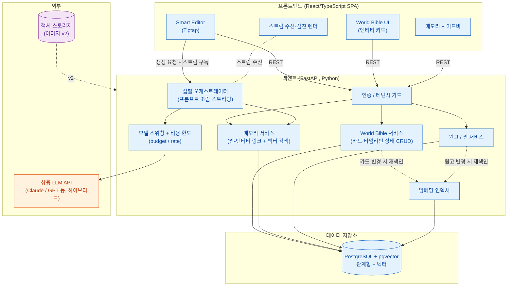
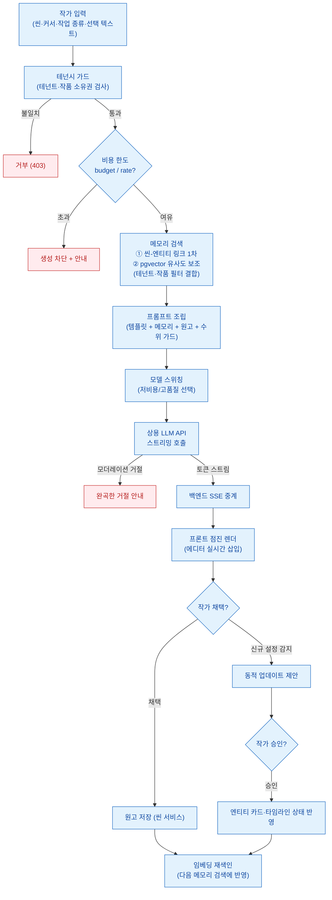

# 시스템 아키텍처: StoryWeaver (가칭)

**AI 기반 웹소설 창작 코파일럿(Co-pilot) SaaS — 시스템 아키텍처 [슬라이스 S2]**

> 본 문서는 `docs/PRD.md`(MVP 범위)와 확정된 핵심 결정(ADR-0001 이원 스택, ADR-0002 하이브리드 메모리, ADR-0003 상용 LLM + 전체이용가)을 일관되게 반영한 시스템 아키텍처다. 용어는 `.forge/CONTEXT.md`를 따른다(작품·World Bible·엔티티 카드·타임라인 상태·씬·씬-엔티티 링크·메모리·모델 스위칭).
>
> 범위: MVP = World Bible + 메모리 + Smart Editor 3종. Plot Architect·분석&피드백·캐릭터 관계도·이미지 생성은 v2+로 미루며, 아키텍처상 자리(객체 스토리지 등)만 남겨둔다.

---

## 1. 전체 구성 (System Overview)

StoryWeaver는 ADR-0001에 따라 프론트엔드와 백엔드를 이원 스택으로 분리한다. 집필 에디터와 실시간 스트리밍 UI가 핵심인 프론트는 React/TypeScript로, AI/메모리 오케스트레이션이 핵심인 백엔드는 FastAPI(Python)로 둔다. 두 스택은 명시적 API 계약(REST + 스트리밍)으로만 통신한다.

구성 요소는 크게 다섯 갈래다.

1. **프론트엔드 (React/TypeScript SPA)** — Tiptap 기반 Smart Editor, World Bible 카드 UI, 메모리 사이드바, 스트리밍 수신·점진 렌더.
2. **백엔드 (FastAPI, Python)** — 인증/테넌시, World Bible CRUD, 메모리(검색·링크·임베딩), 집필 오케스트레이션, 모델 스위칭, 비용 한도(budget/rate).
3. **데이터 저장소 (PostgreSQL + pgvector)** — 관계형 데이터(작품·엔티티 카드·타임라인 상태·씬·원고·씬-엔티티 링크)와 임베딩 벡터를 한 DB에 둔다(ADR-0002).
4. **외부 LLM API (상용, 하이브리드)** — Claude/GPT 등 복수 제공사. 작업 종류별 모델 스위칭(ADR-0003).
5. **객체 스토리지 (v2)** — 이미지 생성 산출물 저장. MVP에서는 미사용(자리만 확보).

아키텍처 경계는 다음 한 줄로 요약된다: 프론트는 "표현·입력·스트림 렌더"만, 백엔드는 "데이터·메모리·LLM 오케스트레이션·격리·비용"을 책임진다. LLM과의 직접 통신은 전부 백엔드를 경유하며, 프론트가 LLM API를 직접 호출하지 않는다(키 노출·비용 우회 방지).

### 1.1. 컴포넌트 다이어그램

아래는 컴포넌트와 의존 방향이다. 프론트 → 백엔드는 REST + 스트리밍, 백엔드 → 저장소/외부 LLM은 각각 DB 드라이버/HTTPS다.



---

## 2. 컴포넌트별 책임과 경계 (Responsibilities & Boundaries)

각 컴포넌트는 하나의 책임 축만 가지며, 경계를 넘는 통신은 명시적 계약(API 또는 DB 스키마)으로만 이뤄진다.

### 2.1. 프론트엔드 (React/TypeScript)

- **Smart Editor (Tiptap 등):** 원고 편집, 커서 위치·선택 영역 관리, 이어쓰기/인필링/지문·대사 변환/문체 변환 호출 트리거. 생성 결과를 에디터에 점진 삽입.
- **World Bible UI:** 엔티티 카드(인물·장소·사건·아이템) 입력·표시, 동적 업데이트 제안의 작가 승인/거절 UI.
- **메모리 사이드바:** 현재 씬과 관련된 설정(씬-엔티티 링크 + 벡터 보조)을 자동 표시.
- **스트림 수신부:** 백엔드의 스트리밍 응답(SSE)을 받아 토큰 단위로 점진 렌더.
- **경계:** LLM API를 직접 호출하지 않는다. 모든 데이터/생성은 백엔드 REST·스트림을 경유한다.

### 2.2. 백엔드 (FastAPI, Python)

- **인증 / 테넌시 가드:** 요청자의 신원·테넌트(작가)를 확인하고, 모든 후속 쿼리를 해당 테넌트의 작품 범위로 스코프(4장 멀티테넌시).
- **World Bible 서비스:** 엔티티 카드·타임라인 상태 CRUD. 카드 변경 시 임베딩 인덱서에 재색인 신호.
- **메모리 서비스:** 현재 씬에 대해 ① 씬-엔티티 링크로 1차 후보를 모으고, ② pgvector 유사도로 보조 후보를 보충해, 컨텍스트 묶음을 만든다(ADR-0002). 메모리는 절대 타 테넌트 데이터를 반환하지 않는다.
- **집필 오케스트레이터:** 작가 입력 + 메모리 결과 + 작업 종류별 프롬프트 템플릿을 조립하고, 모델 스위칭을 통해 LLM을 호출하며, 응답을 스트림으로 프론트에 중계한다.
- **모델 스위칭 + 비용 한도:** 작업 종류(이어쓰기·교정·변환 등)에 따라 저비용/고품질 모델을 선택(ADR-0003). 호출 전 사용자별 budget/rate를 검사하고, 초과 시 차단·안내. 모더레이션 거절은 완곡한 안내로 변환.
- **임베딩 인덱서:** 엔티티 카드·원고(씬) 변경 시 임베딩을 생성·갱신해 pgvector에 저장.
- **원고 / 씬 서비스:** 씬·챕터·원고 본문의 저장·조회. 생성 결과 확정 시 원고에 반영.
- **경계:** 외부 LLM과의 모든 통신은 모델 스위칭 계층을 단일 통로로 거친다(비용·키·모더레이션을 한곳에서 통제).

### 2.3. 데이터 저장소 (PostgreSQL + pgvector)

- 관계형 데이터(작품·엔티티 카드·타임라인 상태·씬·원고·씬-엔티티 링크)와 임베딩 벡터를 단일 DB에 둔다(ADR-0002, 별도 벡터 DB 운영 비용 회피).
- 모든 테이블은 테넌트/작품 식별자를 보유해 격리 쿼리의 근거가 된다.
- **경계:** 백엔드 서비스 계층만 접근한다. 프론트는 직접 접근 불가.

### 2.4. 외부 LLM API (상용, 하이브리드)

- 복수 상용 제공사(Claude/GPT 등)를 작업별로 호출(ADR-0003). 단일 장애점 방지를 위한 다중 제공사 구성을 고려한다(가용성·폴백 정책은 **미결정**, PRD 4.6).
- **경계:** 백엔드 모델 스위칭 계층을 통해서만 접근. 학습 옵트아웃 설정을 사용(PRD 4.3).

### 2.5. 객체 스토리지 (v2)

- v2 이미지 생성 기능의 산출물(캐릭터·장소 설정집 이미지) 저장 용도. **MVP 미사용** — 아키텍처상 자리만 확보한다.

---

## 3. 멀티테넌시 격리 (Multi-tenancy Isolation)

상용 SaaS이므로 테넌트(작가) 간 데이터 격리는 필수다(PRD 4.5). 소유 계층은 `테넌트(작가 계정) → 작품(Work) → 그 하위 모든 데이터(엔티티 카드·타임라인 상태·씬·원고·씬-엔티티 링크·임베딩)`이다. 모든 데이터 접근은 작품 단위로 스코프되며, 그 작품의 소유 테넌트와 요청자의 테넌트가 일치할 때만 허용된다.

격리는 두 지점에서 강제된다. 첫째, 백엔드 진입부의 **인증/테넌시 가드**가 요청자의 테넌트를 확정한다. 둘째, 모든 데이터 쿼리(메모리·벡터 검색 포함)에 테넌트/작품 필터가 강제로 주입되어, **메모리·벡터 검색 결과가 타 테넌트 데이터를 절대 반환하지 않도록** 한다. 특히 pgvector 유사도 검색은 필터 없이 돌리면 전역에서 가장 가까운 벡터를 반환하므로, 유사도 검색 쿼리에도 테넌트/작품 필터를 반드시 결합해야 한다.

격리의 구체적 구현 방식(예: 단일 DB row-level 격리 vs 스키마 분리 vs DB 분리)은 **미결정**이며, 본 슬라이스에서는 "작품 단위 스코프 + 모든 쿼리에 테넌트/작품 필터 강제"라는 불변식만 확정한다. row-level 격리를 1순위 후보로 본다(pgvector 단일 DB 전제와 정합) — 단 확정 아님.

격리 강제 흐름:

```
요청 수신 → 인증/테넌시 가드(테넌트 확정)
          → 작품 소유권 검사(요청 작품의 소유 테넌트 == 요청자 테넌트?)
          → 일치: 테넌트/작품 필터를 모든 쿼리(관계형 + pgvector)에 주입 → 처리
          ↓ 불일치
        거부(403)
```

---

## 4. 핵심 집필 요청 end-to-end 데이터 흐름 (Core Drafting Request)

MVP의 심장인 "한 번의 집필 보조 요청"이 처리되는 전 과정이다. 예: 작가가 특정 씬에서 커서를 두고 "이어 쓰기"를 호출하는 경우.

단계는 다음과 같다.

1. **작가 입력:** 프론트(Smart Editor)에서 현재 씬·커서 위치·작업 종류(이어쓰기/인필링/지문·대사 변환/문체 변환)·선택 텍스트를 백엔드에 생성 요청으로 보낸다.
2. **테넌시 가드:** 백엔드가 요청자 테넌트를 확정하고, 대상 씬이 속한 작품의 소유권을 검사한다(3장). 통과 시에만 진행.
3. **비용 한도 검사:** 모델 스위칭 계층이 사용자별 budget/rate를 검사한다(ADR-0003, PRD 4.1). 초과 시 생성 차단·안내로 분기.
4. **메모리 검색:** 메모리 서비스가 현재 씬에 대해 ① 씬-엔티티 링크로 1차 엔티티 후보(인물·장소 등과 그 타임라인 상태)를 모으고, ② pgvector 유사도로 링크되지 않은 관련 설정을 보조로 보충한다(ADR-0002). 모든 쿼리에 테넌트/작품 필터가 결합된다.
5. **프롬프트 조립:** 오케스트레이터가 [작업 종류별 템플릿 + 메모리 결과(관련 엔티티 카드·타임라인 상태) + 작가 입력/주변 원고]를 하나의 프롬프트로 조립한다. 전체이용가 수위 가드(ADR-0003)를 프롬프트/시스템 지시에 포함한다.
6. **모델 선택 + LLM 호출:** 작업 종류에 따라 저비용/고품질 모델을 선택(모델 스위칭)하고, 스트리밍 모드로 상용 LLM API를 호출한다.
7. **스트리밍 중계:** LLM이 토큰을 흘려보내면 백엔드가 이를 SSE로 프론트에 그대로 중계한다(TTFT 최소화, PRD 4.2). 모더레이션 거절이 감지되면 완곡한 거절 안내로 변환(PRD 4.7).
8. **프론트 점진 렌더:** 프론트가 토큰을 받는 즉시 에디터에 점진 삽입해 작가가 실시간으로 본다.
9. **원고 저장:** 작가가 생성 결과를 확정(수정 후 채택)하면, 원고/씬 서비스가 본문을 저장한다. 신규 설정이 감지된 경우 동적 업데이트 제안 → 작가 승인 시 엔티티 카드/타임라인 상태 반영. 원고·카드 변경은 임베딩 인덱서를 통해 재색인되어 다음 메모리 검색에 반영된다.

비용·모더레이션·미확정 채택 등 분기가 있어 Mermaid로 표현한다.



---

## 5. 외부 LLM 연동·스트리밍·모델 스위칭 (LLM Integration)

### 5.1. 스트리밍 방식 (SSE vs WebSocket)

집필 보조는 체감 즉시성이 핵심이라 스트리밍이 기본이다(PRD 4.2). 데이터 흐름은 본질적으로 단방향(서버 → 클라이언트로 생성 토큰을 흘림)이고, 클라이언트의 추가 입력은 새 HTTP 요청으로 처리하면 충분하다. 따라서 **SSE(Server-Sent Events)를 1순위로 채택**한다 — HTTP 기반이라 인증/프록시/재연결 처리가 단순하고, FastAPI의 스트리밍 응답과 자연스럽게 맞물린다.

WebSocket은 양방향 실시간(예: 협업 동시 편집)이 필요할 때의 후보로 남기되, MVP 범위에는 그 요구가 없으므로 도입하지 않는다. 최종 전송 프로토콜 확정 및 재연결/하트비트 세부는 API 계약 설계 슬라이스에서 다룬다(**미결정**).

```
LLM 토큰 생성 → 백엔드 수신 → SSE 이벤트로 변환 → HTTP 스트림으로 프론트 전송 → 토큰 단위 점진 렌더
```

### 5.2. 모델 스위칭 지점 (Model Switching)

모델 스위칭은 백엔드 단일 계층에서 일어나며, 외부 LLM으로 나가는 모든 호출이 이 지점을 통과한다(ADR-0003). 스위칭 기준은 **작업 종류**다.

- **저비용 모델:** 이어 쓰기처럼 호출 빈도가 높고 짧은 생성.
- **고품질 모델:** 문체 변환·지문/대사 변환처럼 품질 민감도가 높은 작업. (v2 구조 생성·분석도 고품질 측.)

이 단일 통로는 세 가지를 한곳에서 통제하는 경계점이기도 하다: ① budget/rate 비용 한도 검사, ② 학습 옵트아웃 등 제공사 호출 옵션, ③ 모더레이션 거절의 완곡 안내 변환. 작업↔모델 매핑 테이블의 구체 값과 다중 제공사 폴백 동작은 **미결정**(PRD 4.1·4.6).

---

## 6. 리스크 (Risks)

### 6.1. 스택 이원화 비용 (ADR-0001)

ADR-0001은 AI/RAG를 성숙한 Python 생태계에 올리기 위해 백엔드(FastAPI/Python)와 프론트(React/TypeScript)를 처음부터 분리하기로 했다. 그 대가로 다음 비용·리스크가 실재하며, 본 아키텍처는 이를 명시적으로 인지한 상태로 설계되었다.

- **개발 비용:** 두 언어·두 코드베이스의 컨텍스트 전환 비용. 1인/소수 팀에서 특히 부담(ADR-0001 Consequences).
- **배포 비용:** 프론트·백엔드 두 벌의 빌드·배포·CI 파이프라인을 유지해야 한다.
- **채용 비용:** Python 백엔드와 TypeScript 프론트 역량을 모두 갖춘(또는 둘로 나뉜) 인력이 필요하다.
- **API 계약 유지 리스크:** 프론트-백엔드 간 API 계약, 특히 **스트리밍(SSE) 계약**을 명시적으로 설계·유지해야 한다(ADR-0001 Consequences). 계약 드리프트는 스트리밍 렌더 깨짐으로 직결되므로, 계약을 단일 소스로 관리(스키마·버전)할 필요가 있다 — 계약 관리 방식은 **미결정**(API 계약 설계 슬라이스).

이 리스크의 1차 완화책은 LLM/메모리 접근을 백엔드 단일 통로로 좁혀(프론트는 LLM·DB 직접 접근 없음) 경계를 단순·명확하게 유지하는 것이다. 그럼에도 이원화 자체의 운영 비용은 ADR-0001이 의도적으로 수용한 트레이드오프로 남는다.

### 6.2. 기타 아키텍처 리스크

- **단일 장애점(상용 LLM 의존):** 상용 API 장애 시 생성 전체가 멈출 수 있다. 다중 제공사 하이브리드로 완화 의도(ADR-0003)이나 폴백 동작은 **미결정**(PRD 4.6).
- **pgvector 확장 한계:** 대규모 확장 시 단일 DB의 벡터 검색 성능이 병목이 될 수 있다. 전용 벡터 DB 재검토 여지를 남긴다(ADR-0002 Consequences) — 현 시점 **미결정**.
- **테넌트 격리 누락 위험:** pgvector 유사도 검색에 테넌트/작품 필터 결합을 누락하면 타 테넌트 데이터가 새어 나간다(3장). 격리 구현 방식 확정 시 이 불변식을 테스트로 강제해야 한다.

---

## 부록: 관련 결정 (Reference)

- ADR-0001: Python(FastAPI) 백엔드 + React/TypeScript 프론트 이원 스택 — 본 문서 1·6장의 근거.
- ADR-0002: 하이브리드 메모리(정형 엔티티 카드 + 타임라인 상태 + 벡터(pgvector) + 씬-엔티티 링크) — 본 문서 2.3·4장의 근거.
- ADR-0003: 상용 LLM API 하이브리드 + 전체이용가 수위, 모델 스위칭, 비용 한도 — 본 문서 5장의 근거.
- PRD: `docs/PRD.md` (MVP 범위·NFR·사용자 시나리오).
- 용어: `.forge/CONTEXT.md`.
