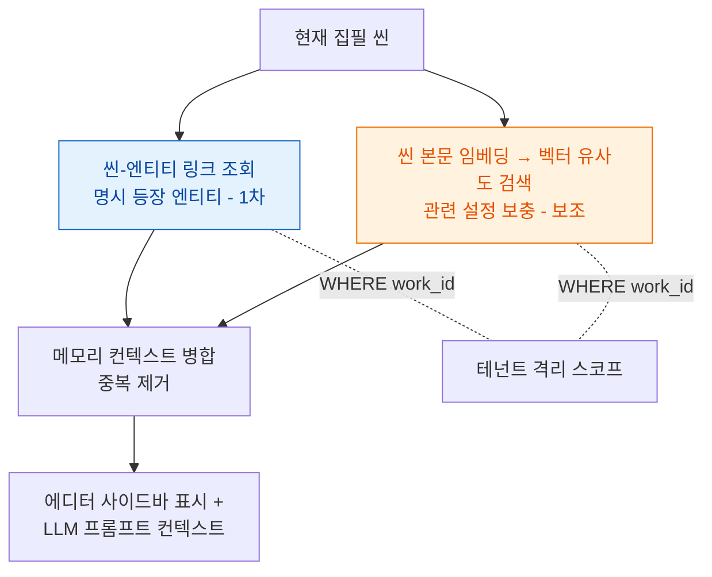
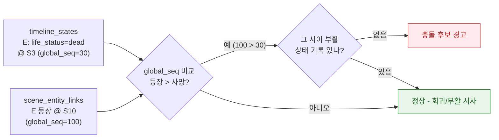
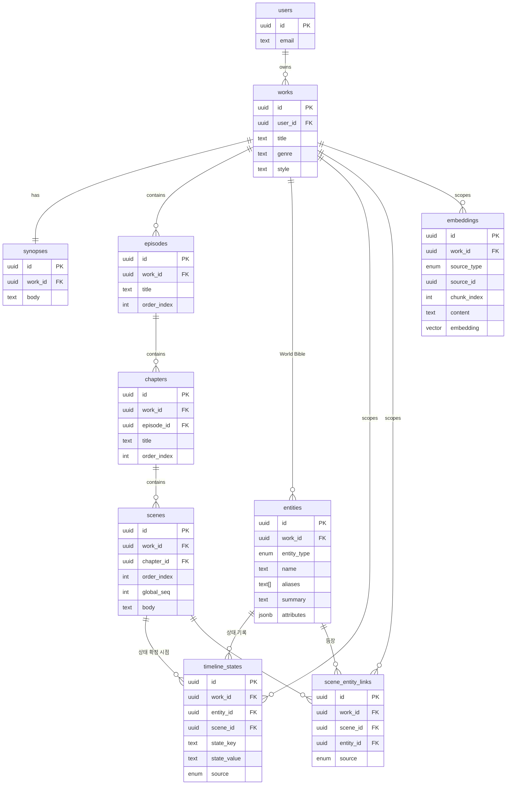

# 데이터 모델: World Bible & 메모리

**StoryWeaver — World Bible 데이터 모델 명세 (슬라이스 S3)**

> 본 문서는 ADR-0002(하이브리드 메모리: 정형 엔티티 카드 + 타임라인 상태 + 벡터(pgvector) + 씬-엔티티 링크)를 데이터 스키마로 구체화한다. 용어는 `.forge/CONTEXT.md`의 canonical 정의를 따른다. 기능 범위는 `docs/PRD.md`를 따른다 — **MVP에서 타임라인 상태는 기록·표시까지이고, 자동 설정 충돌 감지는 v2**다.
>
> 저장소는 PostgreSQL + pgvector 단일 DB(ADR-0002). 아래 스키마는 논리 모델이며, 물리 인덱스·제약의 일부 수치(임베딩 차원, 청크 크기 등)는 명시적으로 **미결정**으로 표기한다.

---

## 1. 모델 개관 (Overview)

데이터 모델은 네 개의 축으로 구성된다.

1. **계층 (Hierarchy):** 작품(Work) → 시놉시스(Synopsis) → 부(Part) → 챕터(Chapter) → 씬(Scene). 원고의 구조적 뼈대.
2. **설정 (World Bible):** 엔티티 카드(Entity Card) — 인물·장소·사건·아이템. 작품의 "기억" 원천 데이터.
3. **상태/링크 (State & Link):** 타임라인 상태(Timeline State)와 씬-엔티티 링크(Scene-Entity Link). "언제 무엇이 어떻게 변했는가"와 "어느 씬에 누가 나오는가"를 잇는다.
4. **벡터 (Embedding):** 엔티티 카드와 씬 본문을 청킹·임베딩해 의미 검색을 보조한다(메모리의 보조 근거).

모든 데이터는 최상위 소유 단위인 **작품(Work)** 에 귀속되고, 작품은 **계정(= 인증 `users` 행)** 에 귀속된다. 이 두 단계의 소유 사슬이 멀티테넌시 격리의 근거다(7장). **테넌트 루트는 별도 `accounts` 테이블이 아니라 auth 도메인의 `users`다 — 회원=계정=사용자(동일인), ADR-0005.**

```
사용자 계정(users)
   └─ 작품(Work)                         ← 멀티테넌시 격리 경계
        ├─ 시놉시스(Synopsis)            ← 작품당 1
        ├─ 부 → 챕터 → 씬(Scene)         ← 계층 본문
        ├─ 엔티티 카드(Entity Card)       ← World Bible
        │     └─ 타임라인 상태(Timeline State)  ← 카드의 시점별 상태
        ├─ 씬-엔티티 링크(Scene-Entity Link)    ← 씬 ↔ 엔티티 다대다
        └─ 임베딩(Embedding)             ← 카드/씬 청크의 벡터
```

---

## 2. 계층 모델 (Work → Synopsis → Part → Chapter → Scene)

> **사용자 대면 명칭은 "부(Part)"** — `.forge/CONTEXT.md` 글로서리가 단일 출처다. 아래 코드/DB 식별자는 `episodes`/`episode_id`로 유지한다(사용자 대면 용어와 코드 식별자를 분리하는 `write`/'집필' 선례와 동일).

작품은 시놉시스 1개와 다수의 부를 가진다. 부는 다수의 챕터를, 챕터는 다수의 씬을 가진다. **씬(Scene)** 은 집필과 AI 생성의 최소 단위이며 실제 원고 본문(`body`)을 보유하는 유일한 계층이다. 상위 계층(부·챕터)은 구조·메타데이터만 보유한다.

순서가 의미를 갖는 계층(부·챕터·씬)은 `order_index`로 형제 간 순서를 표현한다. (드래그 앤 드롭 순서 변경 UI는 v2 Plot Architect 소관이나, 순서 필드 자체는 MVP에서 존재한다.)

타임라인 상태와 충돌 감지가 **챕터/씬 시점**을 기준으로 동작하므로(4장), 씬은 작품 전체에서 단조 증가하는 정렬 가능한 시점값을 가져야 한다. 이를 위해 씬에 `global_seq`(작품 내 전역 순서)를 둔다 — "3화에서 사망 < 10화에서 등장" 같은 시점 비교의 근거다.

### 2.1. 테이블

> **테넌트 루트 = `users` (ADR-0005).** 별도 `accounts` 테이블은 두지 않는다. 인증 도메인의 `users`(id·email·display_name·roles·is_active 등)가 곧 테넌트다. 아래 모든 `→ users` FK가 격리의 뿌리다.

#### `works` (작품)
| 필드 | 타입 | 설명 |
|---|---|---|
| `id` | UUID PK | |
| `user_id` | UUID FK → users | **소유 테넌트.** 모든 하위 데이터 격리의 뿌리 (ADR-0005) |
| `title` | text | 작품 제목 |
| `short_label` | text | 표지/사이드바용 한 글자 약자 |
| `genre` | text | 무협·로판·판타지·회귀물 등 (온보딩 선택) |
| `sub_genre` | text | '회귀' 등 라벨 (목업 `Work.subGenre`) |
| `keywords` | text[] | 키워드 태그 |
| `style` | text | 기본 문체 |
| `status` | text | 연재 중 / 구상 / 초고 |
| `cover_theme` | text | dark / green / orange |
| `created_at` / `updated_at` | timestamptz | |

#### `synopses` (시놉시스)
| 필드 | 타입 | 설명 |
|---|---|---|
| `id` | UUID PK | |
| `work_id` | UUID FK → works, unique | 작품당 1개 |
| `body` | text | 전체 줄거리 요약 |

#### `episodes` (부 — 코드/DB 식별자는 `episodes` 유지)
| 필드 | 타입 | 설명 |
|---|---|---|
| `id` | UUID PK | |
| `work_id` | UUID FK → works | 격리용 비정규화 소유 키(아래 7.2 참조) |
| `title` | text | |
| `order_index` | int | 작품 내 부 순서 |

#### `chapters` (챕터)
| 필드 | 타입 | 설명 |
|---|---|---|
| `id` | UUID PK | |
| `work_id` | UUID FK → works | 격리용 소유 키 |
| `episode_id` | UUID FK → episodes | |
| `title` | text | |
| `order_index` | int | 부 내 챕터 순서 |

#### `scenes` (씬)
| 필드 | 타입 | 설명 |
|---|---|---|
| `id` | UUID PK | |
| `work_id` | UUID FK → works | 격리용 소유 키 |
| `chapter_id` | UUID FK → chapters | |
| `order_index` | int | 챕터 내 씬 순서 |
| `global_seq` | int | **작품 내 전역 단조 순서.** 타임라인 시점 비교의 기준(4장) |
| `title` | text nullable | |
| `body` | text | 실제 원고 본문(임베딩 대상) |
| `created_at` / `updated_at` | timestamptz | |

> **`global_seq` 재계산:** 씬 삽입·이동 시 작품 내 전역 순서를 다시 부여해야 한다. 재계산을 매 변경마다 즉시 할지, 조회 시 `(episode.order_index, chapter.order_index, scene.order_index)` 정렬로 대체할지는 **미결정**(성능 슬라이스에서 확정). 본 모델은 "정렬 가능한 시점값이 존재한다"는 불변식만 요구한다.

### 2.2. 계층 흐름

```
작품(Work) ──1:1── 시놉시스(Synopsis)
    │
    └──1:N── 부 ──1:N── 챕터 ──1:N── 씬(Scene, body 보유)
```

---

## 3. 엔티티 카드 (Entity Card)

엔티티 카드는 World Bible의 한 항목(인물·장소·사건·아이템 중 하나)을 표현하는 정형 데이터 단위다. **공통 필드**는 모든 타입이 공유하고, **타입별 필드**는 `attributes`(JSONB)에 담는다. 타입별 필드를 별도 테이블로 쪼개지 않고 JSONB로 두는 이유는, MVP 단계에서 필드 셋이 자주 바뀔 수 있고 타입이 4종으로 한정되어 단일 테이블 + 판별 컬럼(`entity_type`)이 가장 단순하기 때문이다(과한 정규화 회피).

### 3.1. 공통 필드 — `entities` 테이블

| 필드 | 타입 | 설명 |
|---|---|---|
| `id` | UUID PK | |
| `work_id` | UUID FK → works | **소유 작품.** 격리 경계 |
| `entity_type` | enum(`character`,`location`,`event`,`item`) | 판별 컬럼 |
| `name` | text | 엔티티 이름(고유 명사). 동적 업데이트·링크 추출의 매칭 키 |
| `aliases` | text[] | 별칭·이명(본문 매칭 보조) |
| `summary` | text | 한 줄 요약(메모리 표시·임베딩 대상) |
| `attributes` | JSONB | **타입별 필드**(아래 3.2) |
| `created_at` / `updated_at` | timestamptz | |

> `name`/`aliases`는 동적 업데이트 제안과 씬-엔티티 링크 자동 추출에서 본문 내 등장 매칭의 1차 근거다. 매칭 알고리즘 자체(정확 일치/형태소/임베딩)는 메모리 파이프라인 설계 슬라이스 소관 — 본 문서는 **미결정**.

### 3.2. 타입별 필드 (`attributes` JSONB 스키마)

각 타입의 `attributes`가 갖는 키다. JSONB이므로 DB 제약이 아니라 애플리케이션 레벨 스키마로 검증한다.

**인물 (`character`)** — 기획.md 인물 카드 요구사항 매핑:
| 키 | 설명 |
|---|---|
| `appearance` | 외모 |
| `personality` | 성격 |
| `speech_style` | 말투 |
| `sample_lines` | 샘플 대사 (text[]) — 말투 재현·문체 변환 참조 |
| `relations` | 주요 관계 (아래 3.3) |

**장소 (`location`)**: `description`(묘사), `region`(소속 지역/상위 장소), `atmosphere`(분위기).

**사건 (`event`)**: `description`, `participants`(관련 엔티티 id[]), `occurred_at_scene`(발생 시점 씬 id, nullable).

**아이템 (`item`)**: `description`, `owner`(소유 인물 엔티티 id, nullable), `properties`(효과·속성).

> 위 타입별 키 셋은 MVP 초안이며, 필드 추가·조정 가능성이 있어 DB 스키마가 아닌 JSONB로 둔다. 확정 키 셋은 World Bible UI 슬라이스에서 고정한다(현재 일부 **미결정**).

### 3.3. 인물 관계 (`relations`)

인물 카드의 "주요 관계"는 `attributes.relations`에 **방향성 있는 관계 목록**으로 담는다. 예: `[{ "target_entity_id": "<상대 인물 id>", "type": "사제", "note": "1화에서 첫 만남" }]`.

> 관계의 **시각화**(기본 관계도·챕터별 관계도)는 v2 캐릭터 관계도 기능 소관이다. MVP는 관계 데이터의 **저장**까지만 한다. 관계의 시점별 변화(예: "동료 → 적대")가 필요하면 타임라인 상태(4장)의 `state` 안에서 표현할 수 있으나, MVP에서 관계 변화 추적은 비범위.

---

## 4. 타임라인 상태 (Timeline State)

타임라인 상태는 **한 엔티티가 특정 시점(챕터/씬)에 갖는 상태**를 기록하는 모델이다. 엔티티 카드(3장)가 "현재/요약 설정"이라면, 타임라인 상태는 "그 설정이 언제 어떻게 바뀌었는가"의 시점별 기록이다. 이것이 제품의 핵심 차별점인 상태/사실 추적과 (v2) 설정 충돌 감지의 토대 데이터다(ADR-0002).

핵심 설계 원칙: **상태는 시점(씬)에 묶인 불변 사실의 누적**이다. 카드의 `attributes`를 덮어쓰는 대신, "씬 N 시점에 이 엔티티는 이런 상태였다"를 한 행씩 쌓는다. 시점 비교는 씬의 `global_seq`(2장)로 한다.

### 4.1. 테이블 — `timeline_states`

| 필드 | 타입 | 설명 |
|---|---|---|
| `id` | UUID PK | |
| `work_id` | UUID FK → works | 격리 소유 키 |
| `entity_id` | UUID FK → entities | 상태가 귀속되는 엔티티 |
| `scene_id` | UUID FK → scenes | **상태가 확정된 시점 씬.** 시점 비교는 이 씬의 `global_seq` |
| `state_key` | text | 상태 종류. 예: `life_status`, `power_level`, `location` |
| `state_value` | text | 상태 값. 예: `dead`, `awakened`, `<장소 id>` |
| `note` | text nullable | 근거 문장·작가 메모 |
| `source` | enum(`author`,`ai_suggested`) | 작가 직접 입력인지 AI 동적 업데이트 제안 반영인지 |
| `created_at` | timestamptz | |

`state_key`/`state_value`를 정형 키-값으로 둔 이유: 충돌 감지(v2)가 "같은 `state_key`에 모순되는 `state_value`가 시점 역행으로 나타나는가"를 규칙으로 판정할 수 있게 하기 위함이다. 예약 `state_key`(예: `life_status`의 허용값 `alive`/`dead`)는 충돌 규칙이 필요한 키부터 점진 정의하며, 전체 키 사전은 **미결정**.

### 4.2. 상태 기록 흐름 (MVP)

집필 중 신규 설정이 발생하면 AI가 동적 업데이트를 **제안**하고, 작가 승인 시에만 반영한다(자동 덮어쓰기 아님 — PRD 3.2.1). 반영 시 엔티티 카드 갱신과 타임라인 상태 1행 추가가 함께 일어난다.

```
씬 집필 중 신규 설정 감지
        ↓
AI 동적 업데이트 제안 (source=ai_suggested)
        ↓ 작가 승인
타임라인 상태 1행 추가 (entity_id, scene_id, state_key, state_value)
        ↓
(필요 시) 엔티티 카드 attributes 동기 갱신
```

> MVP에서 타임라인 상태는 **기록·표시까지**다. 위 1행 추가와 검토 화면 표시가 MVP 범위이고, 4.3의 자동 충돌 탐지는 **v2**다.

---

## 5. 씬-엔티티 링크 (Scene-Entity Link)

씬-엔티티 링크는 **특정 씬에 어떤 엔티티가 등장하는지**를 명시하는 다대다 연결이다. 메모리가 무엇을 불러올지 정하는 **1차 근거**이고, 벡터 유사도는 보조다(ADR-0002, CONTEXT). 한 씬은 여러 엔티티를, 한 엔티티는 여러 씬을 가질 수 있다.

### 5.1. 테이블 — `scene_entity_links`

| 필드 | 타입 | 설명 |
|---|---|---|
| `id` | UUID PK | |
| `work_id` | UUID FK → works | 격리 소유 키 |
| `scene_id` | UUID FK → scenes | |
| `entity_id` | UUID FK → entities | |
| `source` | enum(`author`,`ai_extracted`) | 작가 수동 연결인지 AI 자동 추출인지 |
| `created_at` | timestamptz | |
| | | **UNIQUE(`scene_id`, `entity_id`)** — 동일 쌍 중복 방지 |

링크 생성 경로는 두 가지다: 작가 수동 연결(`author`)과, 씬 본문에서 엔티티 `name`/`aliases`를 매칭해 AI가 제안하는 자동 추출(`ai_extracted`). 자동 추출의 매칭/제안 정밀도와 작가 확인 UX는 메모리 파이프라인 슬라이스 소관 — **미결정**.

### 5.2. 메모리 조회 흐름

현재 씬을 집필할 때, 메모리는 먼저 씬-엔티티 링크로 명시 등장 엔티티를 가져오고(1차), 그것으로 부족한 관련 설정을 벡터 검색으로 보충한다(보조). 두 경로 모두 `work_id`로 스코프되어 타 테넌트 데이터를 절대 반환하지 않는다(7장).



---

## 6. 벡터 임베딩 저장 구조 (pgvector)

벡터는 메모리의 **보조** 경로다. 무엇을 임베딩하는가: (a) 엔티티 카드의 `summary` + 주요 `attributes` 텍스트, (b) 씬 본문(`scenes.body`). 씬 본문은 길어질 수 있으므로 청킹 후 청크 단위로 임베딩한다. 엔티티 카드는 통상 짧아 카드당 1청크로 시작한다(길면 분할).

저장은 PostgreSQL + pgvector 단일 테이블 `embeddings`에 폴리모픽으로 둔다. `source_type`/`source_id`로 원본을 가리키고, `work_id`로 격리한다.

### 6.1. 테이블 — `embeddings`

| 필드 | 타입 | 설명 |
|---|---|---|
| `id` | UUID PK | |
| `work_id` | UUID FK → works | **격리 소유 키 — 모든 벡터 검색이 이 컬럼으로 선필터** |
| `source_type` | enum(`entity`,`scene`) | 원본 종류 |
| `source_id` | UUID | 원본 엔티티 또는 씬 id |
| `chunk_index` | int | 원본 내 청크 순번 |
| `content` | text | 임베딩된 원문 청크(재표시·디버깅용) |
| `embedding` | `vector(N)` | 임베딩 벡터. **차원 N = 미결정**(임베딩 모델 확정 시 결정) |
| `created_at` | timestamptz | |

인덱스: `embedding`에 ANN 인덱스(HNSW 등) + `work_id` 선필터. ANN 인덱스 종류·파라미터, 청크 크기/오버랩, 임베딩 모델·차원은 모두 **미결정**(임베딩/검색 튜닝 슬라이스에서 확정). 본 모델은 구조(폴리모픽 + work_id 격리)만 고정한다.

### 6.2. 재임베딩 트리거

엔티티 카드나 씬 본문이 변경되면 해당 `source_id`의 임베딩을 무효화·재생성해야 한다. 동기/비동기(큐) 처리 여부는 **미결정**.

```
엔티티 카드/씬 본문 변경 → 해당 source_id 임베딩 무효화 → 청킹 → 재임베딩 → embeddings 갱신
```

---

## 7. 멀티테넌시 격리 (Multi-tenancy)

상용 SaaS이므로 테넌트(사용자 계정) 간 데이터 격리는 필수다(PRD 4.5). 소유 사슬은 `embeddings/entities/scenes/... → works → users`다. 핵심 불변식: **모든 도메인 테이블이 `work_id`를 직접 보유하고, 모든 쿼리는 `work_id`(궁극적으로 `user_id`)로 스코프된다.** 격리 enforcement는 애플리케이션 레이어 스코핑(now) + RLS(후속)다(ADR-0005). 메모리·벡터 검색 결과가 타 테넌트 데이터를 반환하지 않도록 한다.

### 7.1. 격리 책임 위치

스키마 분리 vs row-level 격리 중 어느 방식을 쓸지는 PRD 4.5에서 **미결정**으로 남아 있다(아키텍처 설계 슬라이스 확정 대상). 본 데이터 모델은 두 방식 모두를 떠받칠 수 있도록 **모든 테이블에 `work_id`를 명시적으로 보유**시킨다. row-level이면 모든 쿼리 `WHERE work_id = ?`(또는 PostgreSQL RLS 정책), 스키마 분리면 작품/계정별 스키마로 매핑된다 — 어느 쪽이든 `work_id` 컬럼은 격리의 공통 근거가 된다.

### 7.2. `work_id` 비정규화 (의도적)

`episodes`/`chapters`/`scenes`/`entities`/`timeline_states`/`scene_entity_links`/`embeddings` 모두 `work_id`를 직접 가진다. 계층을 타고 조인하면 작품을 알 수 있음에도 비정규화하는 이유: 모든 격리 쿼리(특히 벡터 검색)가 조인 없이 단일 컬럼으로 선필터되게 하여, 격리 누락 실수(조인 빠뜨림)를 구조적으로 막기 위함이다. 이는 의도된 중복이다.

---

## 8. 핵심 검증 시나리오: "3화 사망 → 10화 등장" 충돌

이 시나리오가 본 모델로 **표현·탐지 가능**함을 보인다. 이것이 ADR-0002가 순수 벡터 RAG를 거부한 이유다 — 벡터 유사도는 "관련성"만 줄 뿐 시점 모순을 판정하지 못한다.

### 8.1. 표현 (MVP에서 기록되는 데이터)

작품 `W`, 인물 엔티티 `E`(예: "조연 김무사")가 있다고 하자.

1. **3화 사망 기록 (타임라인 상태):**
   - 3화에 속한 씬 `S3`(예: `global_seq = 30`)에서 김무사가 죽는 장면을 집필.
   - AI 동적 업데이트 제안 → 작가 승인 → `timeline_states`에 1행 추가:
     `{ work_id: W, entity_id: E, scene_id: S3, state_key: "life_status", state_value: "dead", source: "ai_suggested" }`
2. **10화 등장 (씬-엔티티 링크):**
   - 10화에 속한 씬 `S10`(예: `global_seq = 100`)에서 김무사가 대사를 하는 장면을 집필.
   - 본문에 "김무사"가 등장 → `scene_entity_links`에 행 추가:
     `{ work_id: W, scene_id: S10, entity_id: E }`. (작가 수동 또는 AI 자동 추출)

이 시점에서 모델에는 "E는 `global_seq 30`에 `life_status=dead`가 됐다"와 "E는 `global_seq 100`인 씬에 등장한다"가 **둘 다 사실로 기록**되어 있다. 두 사실의 시점 비교가 가능하다는 점이 핵심이다.

### 8.2. 탐지 (v2 충돌 감지 규칙)

> MVP는 위 8.1의 **기록·표시까지**다. 아래 자동 탐지는 **v2** 분석&피드백 기능이며, 그 규칙이 본 모델 위에서 SQL로 표현 가능함을 보이는 것이 본 절의 목적이다.

규칙(자연어): "어떤 엔티티 E의 `life_status`가 시점 `seq_dead`에 `dead`로 기록되었는데, E가 `seq_dead`보다 **이후** 씬에 등장(씬-엔티티 링크)하고, 그 사이에 부활/회귀류 상태(`alive`/`revived`)로 되돌리는 타임라인 상태가 **없다면** → 충돌 후보."

이를 본 모델의 테이블로 직접 질의할 수 있다(개념 SQL):

```sql
-- 사망 시점 이후 등장했고, 그 사이 부활 기록이 없는 충돌 후보
SELECT e.name, dead.scene_id AS died_at, appear.scene_id AS reappeared_at
FROM timeline_states dead
JOIN scenes ds       ON ds.id = dead.scene_id
JOIN scene_entity_links appear ON appear.entity_id = dead.entity_id
JOIN scenes as_       ON as_.id = appear.scene_id
JOIN entities e       ON e.id = dead.entity_id
WHERE dead.work_id = :work_id              -- 테넌트 격리
  AND dead.state_key = 'life_status'
  AND dead.state_value = 'dead'
  AND as_.global_seq > ds.global_seq       -- 사망보다 이후 시점 등장
  AND NOT EXISTS (                          -- 그 사이 부활 기록 없음
    SELECT 1 FROM timeline_states rev
    JOIN scenes rs ON rs.id = rev.scene_id
    WHERE rev.entity_id = dead.entity_id
      AND rev.state_key = 'life_status'
      AND rev.state_value IN ('alive','revived')
      AND rs.global_seq > ds.global_seq
      AND rs.global_seq <= as_.global_seq
  );
```

탐지가 성립하는 이유는 세 가지 모델 요소가 맞물리기 때문이다.

- **타임라인 상태**가 "사망"을 특정 시점(`scene_id` → `global_seq`)에 묶어 기록한다 → "언제" 죽었는지 안다.
- **씬-엔티티 링크**가 "등장"을 특정 시점 씬에 묶어 기록한다 → "언제" 다시 나왔는지 안다.
- **`global_seq`**(2장)가 두 시점의 **선후 비교**를 가능케 한다 → "사망 < 등장"의 모순을 판정한다.

벡터 검색만으로는 셋 중 어느 것도 못 한다. 이 시나리오가 하이브리드 메모리(ADR-0002)를 정당화한다.



---

## 9. 엔티티 관계도 (ER Diagram)



---

## 10. 미결정 사항 요약 (Open Questions)

| 항목 | 위치 | 결정 주체 |
|---|---|---|
| `global_seq` 즉시 재계산 vs 조회 시 정렬 대체 | 2.1 | 성능 슬라이스 |
| 타입별 `attributes` 키 셋 확정 | 3.2 | World Bible UI 슬라이스 |
| 본문 내 엔티티 매칭 알고리즘(정확/형태소/임베딩) | 3.1, 5.1 | 메모리 파이프라인 슬라이스 |
| `state_key` 예약 사전·허용값 | 4.1 | v2 충돌 감지 설계 |
| 임베딩 모델·벡터 차원 N | 6.1 | 임베딩/검색 튜닝 슬라이스 |
| 청크 크기·오버랩, ANN 인덱스 종류·파라미터 | 6.1 | 임베딩/검색 튜닝 슬라이스 |
| 재임베딩 동기/비동기(큐) 처리 | 6.2 | 아키텍처 설계 슬라이스 |
| 격리 방식: 스키마 분리 vs row-level/RLS | 7.1 | 아키텍처 설계 슬라이스 |

---

## 부록: 관련 결정 (Reference)
- ADR-0002: 하이브리드 메모리(정형 엔티티 카드 + 타임라인 상태 + 벡터(pgvector) + 씬-엔티티 링크). 본 문서가 그 데이터 스키마 구체화.
- ADR-0001: PostgreSQL 기반 Python 백엔드. pgvector로 관계형+벡터 단일 DB.
- ADR-0003: 콘텐츠/모델 정책. 본 데이터 모델과 직접 결합은 없으나 `source` 구분(작가/AI)으로 생성물 출처를 추적.
- 용어: `.forge/CONTEXT.md` (작품/World Bible/엔티티 카드/타임라인 상태/씬/씬-엔티티 링크/메모리).
- 기능 범위: `docs/PRD.md` (MVP: 기록·표시 / v2: 자동 충돌 감지).
