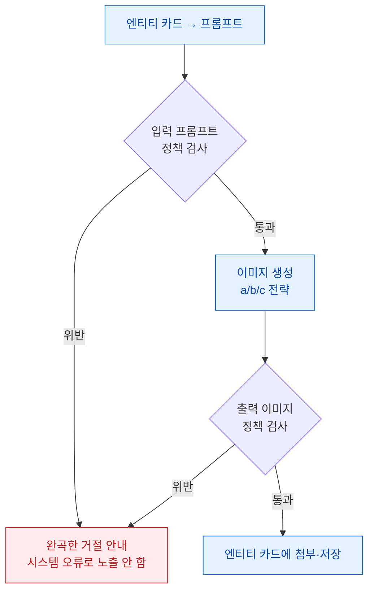

# 이미지 생성 설계 (Image Generation)

> **이 기능은 v2+ 범위다.** MVP는 World Bible + 메모리 + Smart Editor 3종으로 한정되며(PRD 3장), 이미지 생성은 v2+로 미뤄진 부가 기능이다(`기획.md` 5.1, PRD 3.1 표). 본 문서는 v2 진입 시 착수할 설계의 사전 검토이며, 구현 결정이 아니다. 본문에서 "미결정"으로 표기된 항목은 v2 착수 시점의 결정 대상이다.
>
> 용어는 `.forge/CONTEXT.md`를, 콘텐츠 수위·저작권 정책은 ADR-0003 및 PRD 4.3을 따른다.

---

## 1. 목적과 범위

### 1.1. 생성 대상

이미지 생성 기능은 **World Bible의 엔티티 카드와 연동**되어, 카드에 기록된 정형 설정을 시각화하는 것을 목적으로 한다. 두 종류의 엔티티 카드를 대상으로 한다.

- **캐릭터 설정 이미지:** 인물 엔티티 카드의 외모·복장 등 필드를 시각화한 설정 이미지(소위 "캐릭터 설정집").
- **장소 설정 이미지:** 장소 엔티티 카드의 환경·분위기 필드를 시각화한 배경 설정 이미지.

생성된 이미지는 해당 엔티티 카드에 첨부되어 World Bible 안에서 카드와 함께 보관·표시된다. 이미지가 카드의 외부에 독립적으로 떠다니지 않고 카드의 한 자산으로 귀속되는 것이 설계 원칙이다.

### 1.2. 비범위 (Non-Goals)

- **삽화·표지·씬 일러스트 생성:** 본 문서는 설정 이미지(캐릭터·장소)만 다룬다. 본문 삽화나 표지 제작은 별도 사안으로 **미결정**이다.
- **사건·아이템 엔티티 이미지:** 엔티티 카드는 인물·장소·사건·아이템 4종이나(CONTEXT.md), v2 1차 범위는 인물·장소만으로 한정한다. 아이템 이미지는 후속 검토 **미결정**.
- **19금/고수위 이미지:** ADR-0003의 전체이용가 상한이 이미지에도 동일 적용된다(4장 참조). 비목표.

---

## 2. 핵심 난제: 캐릭터 일관성 (Character Consistency)

이미지 생성에서 가장 어려운 문제는 **같은 캐릭터를 매번 같은 얼굴·특징으로 그리는 것**이다. 텍스트→이미지 모델은 기본적으로 매 호출이 독립적이므로, 동일한 인물 카드로 여러 번 생성해도 얼굴·머리색·체형·복장이 흔들린다. 웹소설 설정집은 "이 캐릭터는 항상 이 모습"이라는 동일성이 핵심 가치이므로, 일관성 확보가 이 기능의 성패를 가른다.

장소 이미지는 동일 인물 식별만큼 일관성 요구가 강하지 않으나(같은 장소를 다른 각도로 그려도 허용 범위가 넓음), 캐릭터에서 확보한 해법은 장소에도 부분 적용된다.

### 2.1. 후보 해법

아래 세 접근을 검토한다. 셋은 배타적이지 않으며 조합 가능하다(예: c를 1차로, 안 되면 a로 폴백).

- **(a) 레퍼런스 이미지 + IP-Adapter / 캐릭터 LoRA**
  - 작가가 캐릭터의 레퍼런스 이미지를 제공(또는 1회 생성 후 확정)하고, 그 이미지의 정체성을 IP-Adapter로 주입하거나, 여러 장으로 캐릭터 전용 LoRA를 학습해 모델에 캐릭터를 "각인"시킨다.
  - 자체 호스팅 오픈소스 이미지 모델(Stable Diffusion 계열) 위에서 동작하는 것이 일반적이다.
- **(b) 시드 고정 + 상세 프롬프트 템플릿**
  - 동일 시드(seed)와, 엔티티 카드 필드를 채운 고정 프롬프트 템플릿을 사용해 변동을 최소화한다.
  - 별도 학습·레퍼런스 없이 가장 단순하게 구현된다.
- **(c) 상용 이미지 API의 캐릭터 참조 기능**
  - 상용 이미지 생성 API가 제공하는 캐릭터 일관성/참조 기능(레퍼런스 이미지를 입력으로 받아 동일 인물을 유지하는 기능)을 사용한다.
  - 텍스트 LLM을 상용 API 하이브리드로 가는 ADR-0003의 방향과 일관된다(자체 GPU 호스팅 회피).

흐름으로 보면, 작가의 입력(엔티티 카드 + 선택적 레퍼런스)이 일관성 전략을 거쳐 이미지로 나오고, 결과가 다시 카드에 귀속된다.

```
엔티티 카드 필드 → 프롬프트 변환 → [일관성 전략 a/b/c] → 이미지 생성 → 콘텐츠 정책 검사 → 카드에 첨부
                                         ↑
                              (a/c) 레퍼런스 이미지 입력
```

### 2.2. 트레이드오프 비교표

평가는 상대 등급(높음/중간/낮음)이며, 절대 수치는 v2 착수 시 PoC로 측정해야 하는 **미결정** 사항이다. 비용은 운영 단가(GPU 또는 API 과금) 기준이다.

| 접근 | 일관성 품질 | 비용 | 구현 난도 | 핵심 의존성 / 리스크 |
|---|---|---|---|---|
| **(a) 레퍼런스 + IP-Adapter / 캐릭터 LoRA** | 높음 (LoRA), 중간~높음 (IP-Adapter) | 높음 (GPU 호스팅 + LoRA는 캐릭터별 학습 비용) | 높음 | 자체 GPU 인프라 필요. ADR-0003이 회피한 자체 호스팅 부담을 이미지 축에서 다시 떠안음. 캐릭터마다 LoRA 학습 시 운영·대기시간 부담 |
| **(b) 시드 고정 + 프롬프트 템플릿** | 낮음~중간 (얼굴 동일성 보장 약함) | 낮음 | 낮음 | 가장 단순하나 동일 인물 보장이 약해 설정집 핵심 가치를 충족 못 할 위험. 프롬프트 미세 변화에 결과가 크게 흔들림 |
| **(c) 상용 이미지 API 캐릭터 참조** | 중간~높음 (API 기능 성숙도에 종속) | 중간 (호출당 과금, GPU 운영 없음) | 중간 | 제공사 기능·약관·가용성에 종속. 기능 단종/정책 변경 리스크. 단일 제공사 의존 시 SLA 리스크 |

### 2.3. 권고 (Low confidence — v2 PoC로 확정)

`[Low]` 텍스트 LLM에서 자체 호스팅을 회피한 ADR-0003의 일관된 방향을 따른다면, **1차 후보는 (c) 상용 이미지 API 캐릭터 참조**다. GPU 인프라를 새로 떠안지 않고 ADR-0003의 "상용 API 하이브리드 + 운영 단순화" 철학과 정합한다. (b)는 일관성 보장이 약해 단독으로는 설정집 가치를 못 채울 가능성이 높고, (a)는 품질 상한이 가장 높으나 자체 GPU 부담이 ADR-0003이 명시적으로 피한 비용 구조를 되살린다.

다만 (c)의 캐릭터 참조 기능 성숙도와 한국어 장르(무협 복식 등) 표현력은 **미결정**이며, v2 착수 시 a/b/c를 동일 캐릭터 카드로 PoC 비교해 확정해야 한다. 이 권고는 측정 전 사전 판단이다.

---

## 3. 엔티티 카드 → 프롬프트 변환 매핑

이미지 생성의 입력은 엔티티 카드의 정형 필드다. 어떤 필드가 프롬프트의 어느 부분으로 들어가는지 명시적으로 매핑한다. 자유 텍스트를 통째로 모델에 던지지 않고, 필드 단위로 변환해 일관성과 정책 통제력을 확보한다.

처리 흐름은 카드 필드를 읽어 시각 관련 필드만 추려 프롬프트 슬롯을 채우고, 콘텐츠 정책 필터를 거친 뒤 생성에 넘기는 순서다.

```
카드 로드 → 시각 필드 추출(외모·복장 등) → 프롬프트 슬롯 매핑 → 정책 필터 → 생성 입력
                                                              ↓ 위반
                                                          완곡한 거절 안내
```

### 3.1. 인물 카드 필드 매핑

인물 엔티티 카드의 필드는 PRD 3.2.1 기준 이름·외모·성격·말투(샘플 대사)·관계다. 이 중 **시각화 가능한 필드만** 프롬프트로 변환한다. 성격·말투·관계는 이미지에 직접 반영되지 않으므로 프롬프트에 넣지 않는다(넣으면 노이즈가 됨).

| 엔티티 카드 필드 | 프롬프트 반영 여부 | 변환 위치 / 비고 |
|---|---|---|
| 이름 | 미반영 | 식별자일 뿐 시각 정보 아님. 파일/카드 귀속에만 사용 |
| 외모 | 반영 (핵심) | 얼굴·머리·체형·인종/종족 등 → 프롬프트 주(主) 묘사 슬롯 |
| 복장 | 반영 | 외모 필드 내 복장 서술 또는 별도 복장 필드 → 의상 슬롯. 장르 복식(무협 등) 반영 |
| 성격 | 미반영 | 시각 정보 아님. (선택적으로 표정/포즈 힌트로만 약하게 사용 가능 — **미결정**) |
| 말투(샘플 대사) | 미반영 | 시각 정보 아님 |
| 관계 | 미반영 | 단일 캐릭터 설정 이미지에는 불필요 |

> **카드 스키마 정합성 주의:** 현행 인물 카드 스키마(PRD 3.2.1)는 "외모"를 단일 필드로 둔다. "복장"이 외모에 포함되는지 별도 필드인지는 **미결정**이며, 엔티티 카드 스키마 설계 슬라이스(ADR-0002 Consequences의 "엔티티 카드 스키마")와 정합을 맞춰 확정해야 한다. 이미지 품질·일관성을 위해 복장을 별도 필드로 분리하는 것이 유리할 수 있으나, 이는 카드 스키마 측 결정이다.

### 3.2. 장소 카드 필드 매핑

장소 엔티티 카드의 정형 필드는 아직 PRD에 상세화되지 않았다(**미결정**). v2 착수 시 장소 카드 스키마와 함께 확정하되, 시각화 대상 후보는 다음이다.

| 후보 필드 | 프롬프트 반영 | 비고 |
|---|---|---|
| 환경/지형 묘사 | 반영 (핵심) | 배경 주 묘사 슬롯 |
| 분위기/시간대 | 반영 | 조명·톤 슬롯 (예: 야경, 안개) |
| 양식/문화권 | 반영 | 건축·복식 양식(무협·로판 등 장르 일관성) |

### 3.3. 변환 책임 위치

필드→프롬프트 변환과 콘텐츠 정책 필터는 백엔드(FastAPI)에서 수행한다(ADR-0001). 프롬프트 템플릿과 정책 필터를 백엔드에 두어야 멀티테넌시 격리(PRD 4.5)와 정책 통제가 유지된다. 프론트는 생성 요청·결과 표시만 담당한다. 변환을 LangChain 등으로 LLM에 위임할지(필드를 자연어 프롬프트로 재작성), 규칙 기반 템플릿으로 할지는 **미결정**.

---

## 4. 콘텐츠 정책 (전체이용가 수위)

ADR-0003의 **전체이용가(약 15세) 수위 상한은 텍스트뿐 아니라 이미지에도 동일하게 적용**된다. 19금/고수위 이미지는 비목표다(1.2). 이미지 모더레이션은 텍스트보다 위반 판정·후처리가 까다로우므로 다음 통제를 둔다.

처리 흐름은 입력 프롬프트와 출력 이미지 양쪽에서 정책을 검사하고, 위반 시 시스템 오류가 아니라 **완곡한 거절 안내**(PRD 4.7과 동일 원칙)를 사용자에게 노출하는 것이다.



- **입력 측:** 프롬프트 생성 시 외모/복장 묘사가 수위를 넘지 않도록 필터링(노출·선정 표현 차단).
- **출력 측:** 생성 이미지에 대한 모더레이션 검사. 상용 API는 자체 모더레이션을 내장하나, 자체 호스팅 모델(전략 a) 채택 시 별도 출력 모더레이션을 직접 붙여야 한다 — 이는 (a)의 추가 구현 비용이다.
- **사용자 대면:** 거절 시 무협 잔혹·복수극 표현 등이 걸릴 수 있으므로(ADR-0003), 시스템 오류가 아닌 정책 안내로 완곡하게 처리한다(PRD 4.7과 동일 원칙).
- 모더레이션 임계값·금지 카테고리 목록: **미결정** (v2 착수 시 정책 검토).

---

## 5. 생성물 저작권 처리

이미지 생성물의 저작권은 텍스트 생성물(PRD 4.3)과 별개의 추가 쟁점을 갖는다. AI 이미지는 다수 관할에서 인간 저작자성(human authorship) 부족으로 저작권 보호 자체가 제한될 수 있고, 입력 레퍼런스 이미지(전략 a/c)의 권리 문제가 더해지기 때문이다.

- **생성물 귀속:** 생성 이미지의 사용 권리는 작가(사용자)에게 둔다(PRD 4.3 텍스트와 동일 원칙). 단, 순수 AI 생성물의 저작권 등록 가능 여부는 관할법에 종속됨을 고지 — 텍스트와 달리 이미지는 보호 자체가 불확실할 수 있음을 약관에 명시.
- **레퍼런스 이미지 권리(전략 a/c 채택 시):** 작가가 업로드하는 레퍼런스 이미지의 권리는 작가가 보유·책임진다는 점을 약관에 명시한다. 타인 저작물·실존 인물 무단 사용 방지 고지 필요.
- **제공사 약관 종속:** 상용 이미지 API(전략 c) 사용 시 생성물 권리·상업적 사용 범위·학습 사용 여부는 제공사 약관에 종속됨을 고지(ADR-0003의 텍스트 API와 동일 구조).
- **비학습 약정:** 작가가 업로드한 레퍼런스·생성 이미지를 모델 학습에 사용하지 않도록 옵트아웃을 적용한다(PRD 4.3 비학습 약정의 이미지 확장).
- 세부 약관 문구: **미결정** (법무 검토 필요. 텍스트와 별도 조항 필요할 가능성 높음).

---

## 6. v2 위치 및 의존성

이미지 생성은 v2+ 부가 기능으로, MVP의 World Bible 엔티티 카드 위에 얹힌다. 전제 의존성은 다음과 같다.

- **선행:** 엔티티 카드(인물·장소) 및 카드 스키마(MVP) — 프롬프트 변환의 입력원.
- **연동:** 생성 이미지는 엔티티 카드의 자산으로 귀속·저장(World Bible 내).
- **정책:** ADR-0003 전체이용가 수위, PRD 4.3 저작권 — 이미지로 확장 적용.
- **인프라 분기:** 전략 (c) 상용 API면 ADR-0003의 상용 하이브리드 인프라를 재사용하나, 전략 (a)면 자체 GPU 호스팅이라는 ADR-0003이 회피한 비용 구조가 새로 발생한다 — v2 착수 시 전략 결정이 곧 인프라 결정이다.

```
[MVP] 엔티티 카드 인물·장소 ──→ [v2] 이미지 생성
                                  ├─ 일관성 전략 a/b/c (PoC로 확정)
                                  ├─ 콘텐츠 정책(전체이용가, ADR-0003)
                                  └─ 저작권 처리(PRD 4.3 확장)
```

---

## 부록: 미결정 항목 모음

1. 일관성 전략 a/b/c 최종 선택 (2.3, PoC 측정 후).
2. (c) 상용 이미지 API의 캐릭터 참조 기능 성숙도·한국어 장르 표현력 (2.3).
3. 인물 카드의 "복장" 필드 분리 여부 (3.1, 카드 스키마 슬라이스와 정합).
4. 장소 엔티티 카드 정형 필드 스키마 (3.2).
5. 필드→프롬프트 변환 방식: LLM 위임 vs 규칙 템플릿 (3.3).
6. 모더레이션 임계값·금지 카테고리 (4장).
7. 이미지 저작권 약관 세부 문구 (5장, 법무 검토).
8. 아이템 엔티티 이미지·삽화/표지 생성 범위 (1.2).
```
