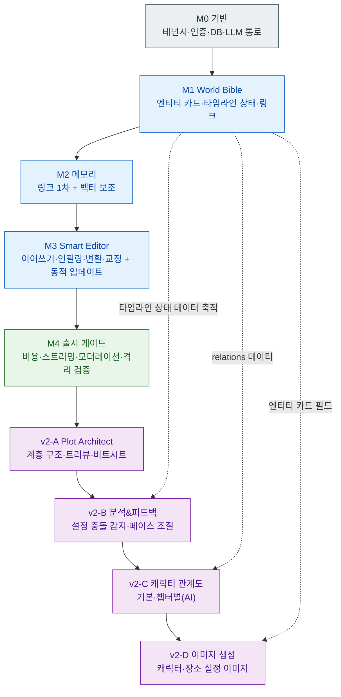

# 출시 로드맵: StoryWeaver (가칭)

**MVP → v2+ 마일스톤 로드맵 (슬라이스 S6)**

> 본 문서는 `docs/PRD.md`(기능 범위·NFR), `docs/architecture.md`(시스템 경계), `docs/data-model.md`(스키마), `docs/ai-pipeline.md`(메모리/프롬프트/모델 스위칭/비용), `docs/image-generation.md`(v2 이미지)를 출시 순서로 엮은 마일스톤 계획이다. 확정된 핵심 결정(ADR-0001 이원 스택, ADR-0002 하이브리드 메모리, ADR-0003 상용 LLM + 전체이용가)을 일관되게 반영한다. 용어는 `.forge/CONTEXT.md`의 canonical 정의를 따른다.
>
> 본 문서가 고정하는 것은 **순서·완료 정의·검증 기준·문서 의존성**이다. 일정(기간·인월)은 팀 규모에 종속되므로 명시적으로 **미결정**이며, 본 로드맵은 달력이 아니라 의존 그래프다.

---

## 1. 로드맵 개관 (Overview)

MVP는 PRD 3.1에서 확정한 3개 핵심 영역(World Bible + 메모리 + Smart Editor)으로 한정한다. 이 셋은 독립 기능이 아니라 **아래에서 위로 쌓이는 의존 스택**이다. 메모리는 World Bible의 데이터(엔티티 카드·타임라인 상태·씬-엔티티 링크) 위에서만 동작하고(ADR-0002, data-model 5장), Smart Editor의 집필 보조는 메모리가 만든 컨텍스트 위에서만 의미를 가진다(ai-pipeline 2~3장). 따라서 **데이터 모델 → 메모리 → 에디터** 순서는 선택이 아니라 의존성이 강제하는 순서다(2장에서 근거 상술).

MVP를 다섯 마일스톤(M0~M4)으로 분해한다. M0(기반)은 멀티테넌시·인증·DB·LLM 통로 등 세 기능 모두가 딛고 서는 토대이며, PRD/아키텍처가 "모든 쿼리는 작품 단위로 스코프"라는 불변식을 깔아 두었기 때문에 첫 마일스톤으로 떼어낸다. M1~M3가 MVP 3종, M4는 출시 게이트(NFR 충족)다.

v2+는 네 기능(Plot Architect → 분석&피드백 → 캐릭터 관계도 → 이미지 생성)으로 이어지며, 각각 MVP가 쌓아 둔 데이터/구조에 전제 의존성이 걸려 있다(4장).

MVP 마일스톤 의존 사슬:

```
M0 기반(테넌시·DB·LLM 통로)
   → M1 World Bible(엔티티 카드·타임라인 상태·링크 데이터)
      → M2 메모리(링크 1차 + 벡터 보조 검색)
         → M3 Smart Editor(메모리 컨텍스트 위 집필 보조 + 동적 업데이트)
            → M4 출시 게이트(비용 한도·스트리밍·모더레이션·격리 검증)
```

전체(MVP→v2) 흐름은 분기·전제조건이 있으므로 Mermaid로 표현한다.



---

## 2. 권장 순서 근거 (Why this order)

순서는 취향이 아니라 데이터·의존성이 강제한다.

1. **기반(M0)이 먼저인 이유:** 아키텍처 3장과 data-model 7장이 "모든 도메인 테이블은 `work_id`를 보유하고 모든 쿼리는 작품 단위로 스코프된다"를 불변식으로 못박았다. 이 격리·인증·DB·LLM 단일 통로(architecture 2.2)가 없으면 그 위에 올리는 어떤 기능도 멀티테넌시 SaaS로 성립하지 않는다. 따라서 토대를 첫 마일스톤으로 분리한다.

2. **World Bible(M1)이 메모리보다 먼저인 이유:** 메모리는 무에서 검색하지 않는다. 씬-엔티티 링크가 메모리의 1차 근거이고 벡터가 보조인데(ADR-0002, CONTEXT), 링크가 가리킬 **엔티티 카드·타임라인 상태**와 청킹·임베딩할 **원본 데이터**가 먼저 존재해야 한다(data-model 3~6장). 데이터가 없는 메모리는 빈 검색이다.

3. **메모리(M2)가 에디터보다 먼저인 이유:** Smart Editor의 차별점은 "기억하는 AI"다. 이어쓰기·인필링·지문/대사 변환은 메모리가 주입한 컨텍스트(관련 엔티티 카드 + 현재 시점까지의 타임라인 상태)를 프롬프트에 넣어야 "죽은 인물이 멀쩡히 등장" 같은 생성 모순을 입력 단계에서 줄인다(ai-pipeline 2~3장). 메모리 검색이 없는 에디터는 문맥 없는 단순 텍스트 생성기로 전락해 제품 정의(PRD 1장) 자체가 무너진다.

4. **출시 게이트(M4)가 마지막인 이유:** 비용 한도(budget/rate)·스트리밍·모더레이션·격리는 기능과 동등 우선순위의 NFR이다(PRD 4장). 일부는 M0~M3에 분산 구현되지만(예: 격리는 M0, 모델 스위칭은 M3), **출시 가능 여부를 판정하는 검증**은 세 기능이 모두 올라온 뒤에야 의미가 있으므로 게이트로 묶는다.

```
기반(격리·통로) → 설정 데이터(World Bible) → 그 데이터를 찾는 메모리 → 메모리를 쓰는 에디터 → 출시 게이트
```

---

## 3. MVP 마일스톤 (M0 ~ M4)

각 마일스톤은 **산출물 / 완료 정의(DoD) / 검증 기준 / 의존 문서**를 갖는다. DoD는 "무엇이 존재하면 끝인가", 검증 기준은 "그것이 동작함을 어떻게 확인하는가"를 분리해 적는다.

> 공통 전제: 모든 마일스톤은 ADR-0001(Python FastAPI 백엔드 + React/TS 프론트), ADR-0002(하이브리드 메모리), ADR-0003(상용 LLM + 전체이용가)을 위반하지 않는다. 미결정 수치(토큰 상한·임베딩 차원·요금제 한도 등)는 각 문서의 "미결정"을 그대로 승계하며, 본 로드맵이 임의로 확정하지 않는다.

### 3.1. M0 — 기반 (Foundation)

세 기능이 공통으로 딛는 토대. 멀티테넌시 격리 불변식과 LLM 단일 통로를 먼저 세운다.

- **산출물**
  - 계정(테넌트) 인증 + 테넌시 가드(architecture 2.2, 3장).
  - PostgreSQL + pgvector 단일 DB 프로비저닝, `accounts`/`works` 및 격리 골격(data-model 2장, 7장).
  - 백엔드↔프론트 골격(REST + SSE 스트리밍 계약 초안)과 LLM 단일 통로(모델 스위칭 계층의 빈 골격, architecture 5장).
  - 작품(Work) 생성·온보딩(장르·문체 선택, PRD 5장 1단계).
- **완료 정의 (DoD)**
  - 한 계정이 작품을 만들고, 그 작품에 속한 데이터만 조회된다.
  - 모든 도메인 테이블이 `work_id`를 보유한다(data-model 7.2 비정규화 불변식).
  - 백엔드가 SSE로 더미 토큰 스트림을 프론트에 흘려 보내고 프론트가 점진 렌더한다(스트리밍 계약 동작 확인).
- **검증 기준**
  - **격리 테스트:** 계정 A의 토큰으로 계정 B의 작품/하위 데이터 접근 시 403 또는 빈 결과. (architecture 6.2 "격리 불변식을 테스트로 강제" 충족.)
  - 작품 단위 스코프가 빠진 쿼리가 없음을 코드/테스트로 확인.
- **의존 문서:** architecture(2.2, 3장 격리), data-model(2장 계층, 7장 멀티테넌시), ADR-0001/0002.
- **미결정 승계:** 격리 구현 방식(row-level/RLS vs 스키마 분리, data-model 7.1)·SSE 재연결/하트비트 세부(architecture 5.1)는 본 마일스톤에서 1순위 후보(row-level)로 진행하되 확정은 해당 슬라이스 소관.

### 3.2. M1 — World Bible

메모리가 검색할 설정 데이터를 만든다. 충돌 감지(v2)와 이미지 생성(v2)의 입력원도 여기서 쌓이기 시작한다.

- **산출물**
  - 엔티티 카드 CRUD: 인물·장소·사건·아이템 4종(공통 필드 + 타입별 `attributes` JSONB, data-model 3장).
  - 인물 카드 필드: 이름·외모·성격·말투(`sample_lines`)·관계(`relations`)(PRD 3.2.1, data-model 3.2~3.3).
  - 타임라인 상태 기록·표시 UI(`timeline_states` 1행 추가, `source` 구분, data-model 4장).
  - 씬-엔티티 링크 수동 연결(작가 직접, `source=author`, data-model 5장).
  - 계층 골격(작품→시놉시스→에피소드→챕터→씬)과 `global_seq`(시점 비교 근거, data-model 2장). MVP에서 시놉시스/Outline은 작가 수동(PRD 5장 3단계).
- **완료 정의 (DoD)**
  - 4종 카드를 만들고 편집하며, 인물 카드에 관계를 저장할 수 있다.
  - "3화에서 사망" 같은 타임라인 상태를 한 행으로 기록하고 검토 화면에서 시점순으로 본다.
  - 씬을 만들고 그 씬에 등장 엔티티를 수동으로 링크한다.
  - data-model 8.1의 "표현" 데이터(타임라인 상태 + 씬-엔티티 링크 + `global_seq`)가 실제로 저장된다.
- **검증 기준**
  - **핵심 시나리오 데이터 표현 검증:** "3화 사망 → 10화 등장" 사실 두 개가 모델에 모두 기록되고 `global_seq`로 선후 비교가 가능함을 확인(data-model 8.1). **단, 자동 탐지는 하지 않는다 — 기록·표시까지가 MVP**(PRD 3.1, data-model 8.2 경계).
  - 카드/타임라인 상태/링크 모두 타 테넌트에서 보이지 않음(M0 격리 회귀).
- **의존 문서:** data-model(2~5장 전부), PRD(3.2.1 World Bible, 5장 Bible Setup), CONTEXT(엔티티 카드·타임라인 상태·씬-엔티티 링크 정의).
- **미결정 승계:** 타입별 `attributes` 키 셋 확정(data-model 3.2)·`state_key` 예약 사전(data-model 4.1)·본문 내 엔티티 매칭 알고리즘(data-model 3.1)은 그대로 미결정. M1은 작가 **수동** 입력까지만 보장하고 자동 추출은 M3 동적 업데이트로 미룬다.

### 3.3. M2 — 메모리 (Memory)

M1의 데이터를 현재 씬 기준으로 찾아 컨텍스트로 구성한다. ADR-0002 하이브리드의 핵심 마일스톤.

- **산출물**
  - 임베딩 인덱서: 엔티티 카드(`summary`+`attributes`)·씬 본문 청킹·임베딩 → `embeddings` 저장(data-model 6장, ai-pipeline 2장).
  - 메모리 검색: ① 씬-엔티티 링크 1차 로드(현재 `global_seq` 이하 타임라인 상태만, 미래 상태 차단) + ② pgvector ANN 보조 검색(`work_id` 선필터) → 병합·중복제거·우선순위화(P1~P4, ai-pipeline 2.1).
  - 메모리 사이드바: 현재 씬 관련 설정 자동 표시(PRD 3.2.2, architecture 2.1).
  - 재임베딩 트리거: 카드/씬 변경 시 무효화·재생성(data-model 6.2, ai-pipeline 5.3).
- **완료 정의 (DoD)**
  - 현재 씬을 열면 링크된 엔티티(1차) + 벡터 유사 설정(보조)이 사이드바에 뜬다.
  - 타임라인 상태가 현재 시점(`global_seq`) 이하로만 노출된다(스포일러/시점 역행 방지, ai-pipeline 2.1).
  - 모든 검색 경로(링크·벡터)에 `work_id` 필터가 결합된다.
- **검증 기준**
  - **벡터 격리 테스트:** pgvector 유사도 검색에 `work_id` 필터를 빼면 타 테넌트 벡터가 반환됨을 보이고, 필터가 있으면 자기 작품 결과만 반환됨을 확인(architecture 3장·6.2, data-model 7장 "필터 누락 = 누수" 불변식).
  - **시점 필터 테스트:** 미래 씬에서 확정된 타임라인 상태가 과거 씬 집필 시 메모리에 새지 않음(ai-pipeline 2.1 1단계).
  - 링크된 엔티티가 벡터 결과보다 우선(중복 시 1차 우선, ai-pipeline 2.1 3단계).
- **의존 문서:** ai-pipeline(2장 검색 흐름, 5.3 캐싱), data-model(5장 링크, 6장 임베딩, 7장 격리), ADR-0002.
- **미결정 승계:** 벡터 top-K·1차/보조 토큰 배분·커서 윈도(ai-pipeline 2.1)·임베딩 모델/차원 N·청크 크기·ANN 인덱스 파라미터(data-model 6.1)는 미결정. M2는 구조(링크 1차 + 벡터 보조 + 격리)를 동작시키되 수치는 임베딩/검색 튜닝 슬라이스에서 확정.

### 3.4. M3 — Smart Editor

메모리 컨텍스트 위에서 집필 보조 기능(이어쓰기·인필링·지문/대사 변환 + 문체 변환·교정 + 동적 업데이트)을 제공한다. 사용자가 직접 만지는 제품 표면.

- **산출물**
  - 집필 보조 4작업: 이어쓰기(Continue)·인필링(In-filling)·지문/대사 변환·문체 변환, 그리고 단어/문장 교정(PRD 3.2.3, ai-pipeline 3.1).
  - 작업별 프롬프트 조립(공통 베이스 + 작업별 지시 + 메모리 컨텍스트 + 전체이용가 수위 가드, ai-pipeline 3장).
  - 모델 스위칭: 작업별 저비용/고품질 티어 라우팅 + 저비용→고품질 승격(ai-pipeline 4장, ADR-0003).
  - 스트리밍 생성: SSE로 토큰 점진 렌더(architecture 5.1, PRD 4.2).
  - 동적 업데이트: 씬 저장/확정 시 비동기 추출 → 신규 엔티티/속성 변경/타임라인 상태 변화 제안 → 작가 승인 후 반영(자동 덮어쓰기 없음) + 씬-엔티티 링크 자동 추출(`ai_extracted`)(ai-pipeline 7장, data-model 4.2·5.1).
- **완료 정의 (DoD)**
  - 작가가 커서 위치에서 이어쓰기를 호출하면 메모리 컨텍스트가 주입된 후보가 스트리밍으로 들어온다.
  - 지문/대사 변환이 해당 인물의 `speech_style`/`sample_lines`를 반영한다(ai-pipeline 3.1).
  - 작업 종류에 따라 저비용/고품질 모델이 분기되고, 승격 시 budget 재검사가 걸린다(ai-pipeline 4.2).
  - 집필 후 신규 설정이 AI 제안으로 뜨고, 작가 승인 시에만 카드/타임라인 상태에 반영된다.
- **검증 기준**
  - PRD 5장 사용자 시나리오(Onboarding→Bible→Outline 수동→Drafting→Review)를 **1화 초고**까지 한 번에 통과(자동 충돌 감지·비트시트 제외 — v2).
  - 메모리에 "사망" 상태가 있는 인물을 이어쓰기 컨텍스트에 넣었을 때, 생성 모순이 입력 단계에서 줄어듦을 정성 확인(ai-pipeline 3.1 설계 근거).
  - 동적 업데이트 제안을 거절하면 데이터가 바뀌지 않음(승인 게이트 동작).
- **의존 문서:** ai-pipeline(3장 프롬프트, 4장 모델 스위칭, 7장 동적 업데이트), architecture(4장 end-to-end 흐름, 5장 스트리밍), PRD(3.2.3, 5장 시나리오), ADR-0003.
- **미결정 승계:** 작업별 프롬프트 최종 문구·few-shot(ai-pipeline 3.1)·구체 모델 ID/제공사·폴백 대상(ai-pipeline 4.1)·승격 품질 게이트(ai-pipeline 4.2)·동적 업데이트 트리거 임계·큐 인프라(ai-pipeline 7.1)는 미결정.

### 3.5. M4 — 출시 게이트 (Launch Gate, NFR)

기능이 다 올라온 뒤 상용 SaaS로 내보낼 수 있는지 판정한다. PRD 4장 NFR을 검증 대상으로 본다.

- **산출물**
  - 비용 한도: 사용자별 budget/rate 게이트 동작(ai-pipeline 5.2, PRD 4.1) + 모델 승격 시 재검사.
  - 모더레이션 처리: 선제 가드·API 거절 완곡 안내·완화 재시도 1회(ai-pipeline 6장, PRD 4.7).
  - 컨텍스트 윈도 예산: 작업별 입력/출력 토큰 상한 적용(ai-pipeline 5.1).
  - 캐싱: 프롬프트 프리픽스·임베딩·결정적 결과 캐시 정책(ai-pipeline 5.3).
  - 약관 골격: 생성물 귀속·작가 원고 비학습 옵트아웃 고지(PRD 4.3).
- **완료 정의 (DoD)**
  - budget 초과 시 생성이 차단되고 시스템 오류가 아닌 안내가 노출된다.
  - 모더레이션 거절이 완곡 안내로 변환되고 raw 에러가 노출되지 않는다.
  - 멀티테넌시 격리 회귀 테스트(M0·M2)가 전부 통과한다.
- **검증 기준**
  - **비용 한도 테스트:** 한도 초과를 강제 주입했을 때 생성 차단 + 안내(PRD 4.1, ai-pipeline 5.2).
  - **모더레이션 테스트:** 19금 수위 입력에 대해 선제 가드/완곡 안내가 동작하고 시스템 오류 코드가 노출되지 않음(ai-pipeline 6장).
  - **격리 종합 회귀:** 관계형 + pgvector 모든 경로에서 타 테넌트 누수 0건.
- **의존 문서:** PRD(4장 NFR 전부), ai-pipeline(5장 비용, 6장 모더레이션), architecture(3장 격리, 6장 리스크).
- **미결정 승계:** 요금제별 한도 수치·TTFT 목표·SLA·폴백 동작·데이터 리전/보관 정책·약관 세부 문구(PRD 4.1~4.6)는 미결정 — 출시 전 부하 테스트·법무 검토로 확정. **이 미결정들이 닫혀야 정식 상용 출시 가능**(베타는 일부 열린 채 가능, 단 격리·모더레이션·비용 차단은 베타에서도 필수).

---

## 4. v2+ 마일스톤 (출시 순서와 진입 전제조건)

v2 순서는 **MVP가 쌓은 데이터/구조에 대한 의존성**으로 정해진다. Plot Architect가 구조를 채우면, 그 위에 분석(충돌 감지)이 의미를 갖고, 관계도는 MVP의 `relations` 데이터를, 이미지는 MVP의 엔티티 카드 필드를 입력으로 쓴다. 이미지가 가장 뒤인 이유는 인프라 분기(자체 GPU vs 상용 API)가 가장 무겁고 카드 스키마 확정에 종속되기 때문이다(image-generation 6장).

> v2는 MVP(M0~M4)가 **출시 게이트를 통과한 뒤** 착수한다. 아래 각 항목의 "진입 전제조건"이 충족되지 않으면 시작하지 않는다.

### 4.1. v2-A — Plot Architect (구조 설계)

- **기능:** 계층적 구조 설계(시놉시스→에피소드→챕터→씬), 트리 뷰(드래그 앤 드롭 순서 변경), 비트 시트 자동 생성("회귀물 1화 국룰 전개")(PRD 3.1, 기획.md 3.2).
- **진입 전제조건:**
  - MVP 계층 골격과 `order_index`/`global_seq`가 존재(data-model 2장 — MVP에서 필드는 이미 있음, v2는 드래그 앤 드롭 UI와 `global_seq` 재계산을 채운다).
  - 고품질 모델 티어와 모델 스위칭이 동작(ai-pipeline 4.1 — 비트 시트는 고품질 티어).
- **의존 문서:** data-model(2.1 `global_seq` 재계산 미결정, 2.2 계층), ai-pipeline(4.1 v2 행), PRD(3.1).
- **왜 v2 첫 번째:** 구조가 채워져야 그 위 분석(페이스 조절 등)이 분석할 대상을 갖는다.

### 4.2. v2-B — 분석 & 피드백 (설정 충돌 감지 · 페이스 조절)

- **기능:** 설정 충돌 감지("3화에서 죽은 캐릭터가 10화에 등장" 자동 경고), 페이스 조절(대화/서술 빈도 분석)(PRD 3.1, data-model 8.2).
- **진입 전제조건 (핵심):**
  - **MVP에서 타임라인 상태 데이터가 충분히 축적**되어 있어야 한다. 충돌 감지는 무에서 못 한다 — M1/M3에서 `timeline_states`와 씬-엔티티 링크가 쌓여 있어야 data-model 8.2의 탐지 SQL이 의미를 갖는다.
  - `state_key` 예약 사전·허용값 확정(data-model 4.1·10장 미결정 — 충돌 규칙이 필요한 키부터 정의).
- **의존 문서:** data-model(4장 타임라인 상태, 8장 충돌 감지 SQL·검증 시나리오), PRD(3.1), ai-pipeline(4.1 "설정 충돌 감지 = 규칙/SQL + 선택적 저비용 LLM").
- **왜 두 번째:** MVP가 8.1의 "표현"까지만 했고 8.2의 "탐지"는 v2다. 이 마일스톤이 ADR-0002가 순수 벡터 RAG를 거부한 차별점을 비로소 사용자에게 노출한다.

### 4.3. v2-C — 캐릭터 관계도

- **기능:** 기본 관계도 시각화, 챕터별 관계도(AI 자동 생성)(PRD 3.1, 기획.md 5장).
- **진입 전제조건:**
  - **MVP의 인물 카드 `relations` 데이터**가 입력원(data-model 3.3 — MVP는 관계 데이터 저장까지, 시각화는 v2).
  - 챕터별 관계도는 시점별 관계 변화가 필요하므로, 관계 변화를 타임라인 상태(`state` 안)로 표현하는 설계가 선행(data-model 3.3 "MVP에서 관계 변화 추적은 비범위" → v2에서 확정). 따라서 v2-B(타임라인/상태 규칙)와 정합을 맞춘 뒤가 안전.
- **의존 문서:** data-model(3.3 relations, 4장 타임라인 상태로 시점별 변화 표현), PRD(3.1).
- **왜 세 번째:** 기본 관계도는 `relations`만으로 가능하나, "챕터별(AI)" 요구가 시점별 상태에 의존하므로 v2-B 이후가 자연스럽다.

### 4.4. v2-D — 이미지 생성 (캐릭터 · 장소 설정 이미지)

- **기능:** 인물·장소 엔티티 카드를 시각화한 설정 이미지, 카드에 첨부 저장(image-generation 1장, PRD 3.1).
- **진입 전제조건:**
  - **MVP 엔티티 카드(인물·장소) 및 카드 스키마 확정**이 프롬프트 변환 입력원(image-generation 6장).
  - 인물 카드 "복장" 필드 분리 여부 확정(image-generation 3.1, 카드 스키마 슬라이스와 정합).
  - 장소 엔티티 카드 정형 필드 스키마 확정(image-generation 3.2 — MVP에 상세화 안 됨, v2 착수 시 확정).
  - **인프라 분기 결정 = 전략 결정:** 일관성 전략 a/b/c PoC 비교 후 선택(image-generation 2.3). (c) 상용 API면 ADR-0003 인프라 재사용, (a) 자체 GPU면 ADR-0003이 회피한 비용 구조가 새로 발생 — **별도 의사결정/ADR 필요**.
  - 객체 스토리지 실제 도입(architecture 2.5 — MVP는 자리만 확보).
- **의존 문서:** image-generation(전체), architecture(2.5 객체 스토리지), PRD(4.3 저작권 이미지 확장), ADR-0003(전체이용가 이미지 확장).
- **왜 마지막:** 인프라 분기(자체 GPU 가능성)·카드 스키마 종속·저작권 추가 쟁점(human authorship 불확실, image-generation 5장)이 가장 무겁고, MVP/다른 v2 기능에 역의존이 없다(독립적으로 가장 뒤에 둘 수 있음).

v2 의존 사슬 요약:

```
Plot Architect(구조를 채움)
   → 분석&피드백(MVP 타임라인 상태 위에서 충돌 감지)
      → 캐릭터 관계도(relations + 시점별 상태 위에서 시각화)
         → 이미지 생성(엔티티 카드 + 인프라 분기 결정 후)
```

---

## 5. 마일스톤 ↔ 설계 문서 교차참조 (Traceability)

각 마일스톤이 어떤 슬라이스(S2~S5) 문서에 의존하는지의 매트릭스. ●=핵심 의존, ○=부분 참조.

| 마일스톤 | PRD (S1) | architecture (S2) | data-model (S3) | ai-pipeline (S4) | image-generation (S5) |
|---|---|---|---|---|---|
| M0 기반 | ● 4.5 격리 | ● 2.2·3장 | ● 2·7장 | ○ 5장(통로) | — |
| M1 World Bible | ● 3.2.1 | ○ 2.2 | ● 2~5장 | — | — |
| M2 메모리 | ● 3.2.2 | ● 3·4장 | ● 5·6·7장 | ● 2장·5.3 | — |
| M3 Smart Editor | ● 3.2.3·5장 | ● 4·5장 | ○ 4.2·5.1 | ● 3·4·7장 | — |
| M4 출시 게이트 | ● 4장 NFR | ● 3·6장 | ○ 7장 | ● 5·6장 | — |
| v2-A Plot Architect | ● 3.1 | ○ | ● 2장 | ● 4.1 | — |
| v2-B 분석&피드백 | ● 3.1 | ○ | ● 4·8장 | ● 4.1 | — |
| v2-C 관계도 | ● 3.1 | — | ● 3.3·4장 | — | — |
| v2-D 이미지 생성 | ● 3.1·4.3 | ● 2.5 | ○ 3장 | ○ (모더레이션 패턴) | ● 전체 |

> S1=PRD, S2=architecture, S3=data-model, S4=ai-pipeline, S5=image-generation, S6=본 roadmap.

---

## 6. 일관성 점검 (다른 5개 문서와의 모순 확인)

본 로드맵이 다른 문서와 충돌하지 않음을 명시한다.

- **MVP 범위:** M1~M3 = World Bible + 메모리 + Smart Editor (3개 핵심 영역). PRD 3.1·architecture 범위·data-model 5번 주석·ai-pipeline 범위 경계와 일치. Plot Architect·분석·관계도·이미지는 v2(4장)로 동일하게 미룸.
- **순서 근거:** "데이터 모델 → 메모리 → 에디터"는 ADR-0002(링크 1차 + 벡터 보조)와 ai-pipeline 2장(메모리가 카드/상태 위에서 동작)에 정합.
- **타임라인 상태 경계:** MVP는 기록·표시(M1·data-model 8.1), 자동 충돌 감지는 v2-B(data-model 8.2). 두 문서 모두와 일치.
- **수위/모더레이션/비용:** M4·v2-D 모두 전체이용가 상한(ADR-0003)·완곡 거절(PRD 4.7)·budget/rate(ai-pipeline 5장)를 승계. 19금은 비목표(PRD 6장).
- **미결정 보존:** 본 로드맵은 다른 문서의 미결정(임베딩 차원·요금제 수치·격리 방식·이미지 전략 등)을 확정하지 않고 해당 마일스톤의 "미결정 승계"로 넘긴다 — 추측·과장 없음.

---

## 부록: 관련 결정 (Reference)

- ADR-0001: Python(FastAPI) 백엔드 + React/TS 프론트 — M0·M3 스트리밍 계약 근거.
- ADR-0002: 하이브리드 메모리(정형 카드 + 타임라인 상태 + 벡터 + 링크) — M1·M2·v2-B 근거.
- ADR-0003: 상용 LLM + 전체이용가 + 모델 스위칭 + 비용 한도 — M3·M4·v2-D 근거.
- 문서: `docs/PRD.md`(S1), `docs/architecture.md`(S2), `docs/data-model.md`(S3), `docs/ai-pipeline.md`(S4), `docs/image-generation.md`(S5).
- 용어: `.forge/CONTEXT.md`.
